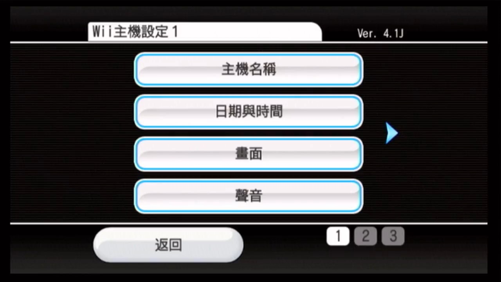
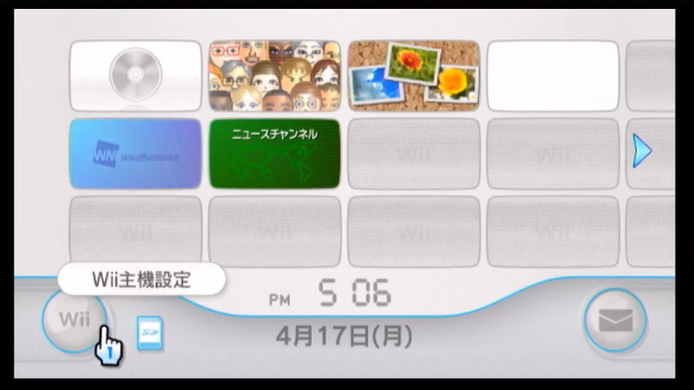
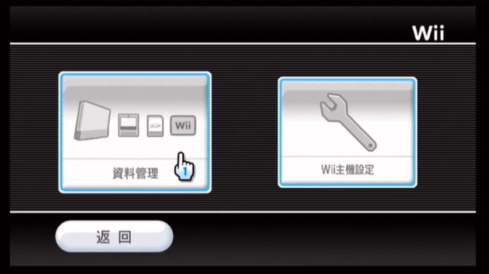
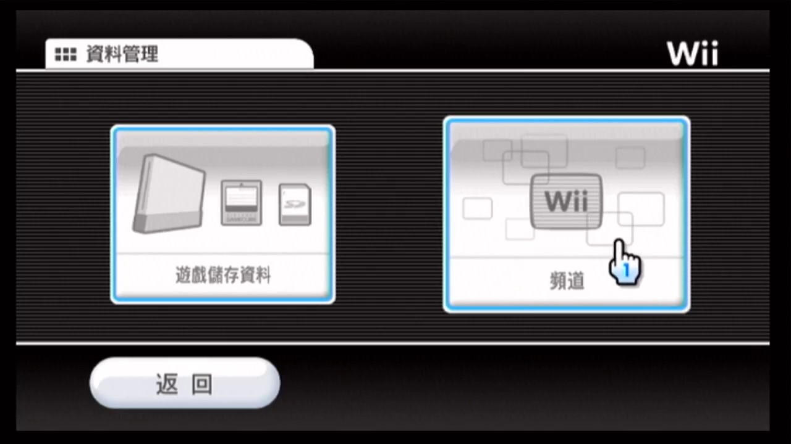
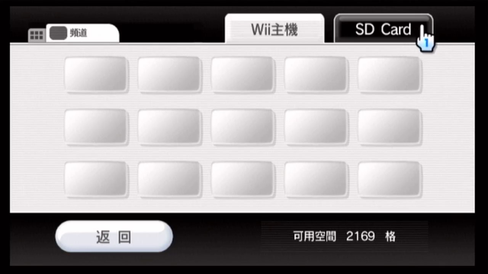
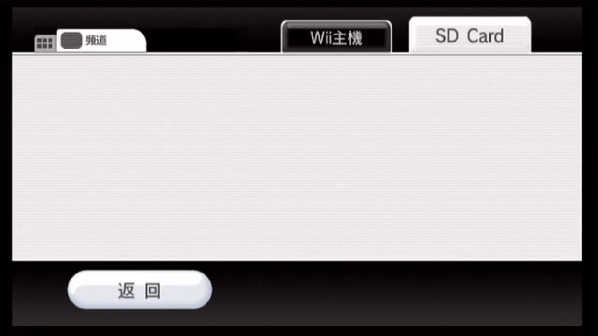
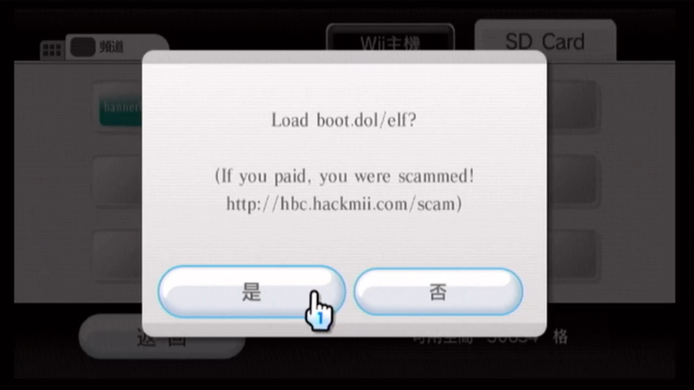
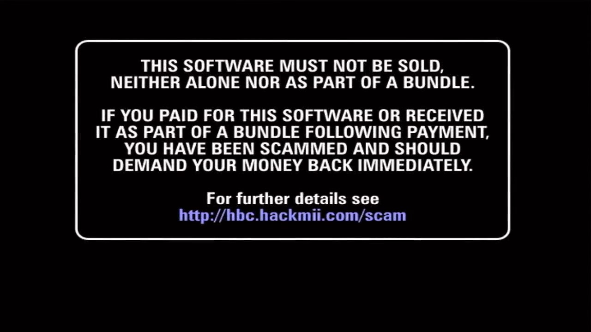

# 通过 Bannerbomb 漏洞安装 HBC  {#bannerbomb-v1}

## 一、背景知识

Wii 能够从 SD 卡读取频道的数据。如果先将“特别的”频道数据文件拷贝到 SD 卡上，然后在 Wii 里面选择从 SD 卡读取频道，就能触发 Bannerbomb 漏洞，漏洞会执行 SD 卡根目录的 boot.elf 文件，启动 HackMii Installer。

## 二、相关文件

| 文件名 | 说明 |
| --- | --- |
| aad1f_v108.zip | 上文所说的“特别的”频道数据文件 |
| boot.elf | 来自 HackMii Installer v1.0，v1.0 能兼容 3.x 系统，而 v1.2 不行 |

## 三、注意事项

- 3.x 的系统不支持 SDHC，不能识别大于 2GB 的 SD 卡；

- 4.0 及以上的系统支持 SDHC，大于 2GB 的 SD 卡也能支持；

- 本文提到的 Bannerbomb 漏洞只适用于 4.1 及以下系统，任天堂在 4.2 和 4.3 系统中已经修复了此漏洞。

## 四、操作步骤

下面演示如何在 4.1J 系统中通过 Bannerbomb 漏洞安装 HBC:

1. 在系统主界面，点左下角的 Wii 按钮进入主机设定： 
  

2. 在主机设定界面，点左边的按钮进入资料管理： 
  

3. 在资料管理界面，点右边的按钮进入频道： 
  

4. 在频道界面，点 SD Card 标签： 
  

5. 耐心等待 SD Card 加载： 
  

6. 在弹出的询问对话框中，点左边的按钮： 
  

7. 稍事等待，就能看到 HackMii Installer 的启动界面： 
  

8. 接下来请参考[《使用 HackMii Installer v1.0》](@ref hmiv1-0)，完成 HBC 的安装。

## 五、参考链接

- <https://bannerbomb.qoid.us/index.old.php>
