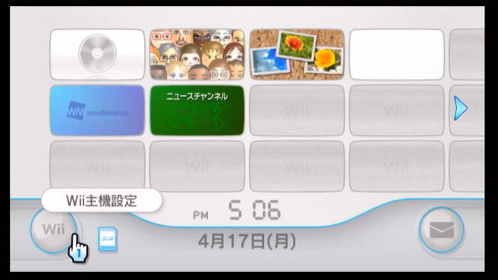
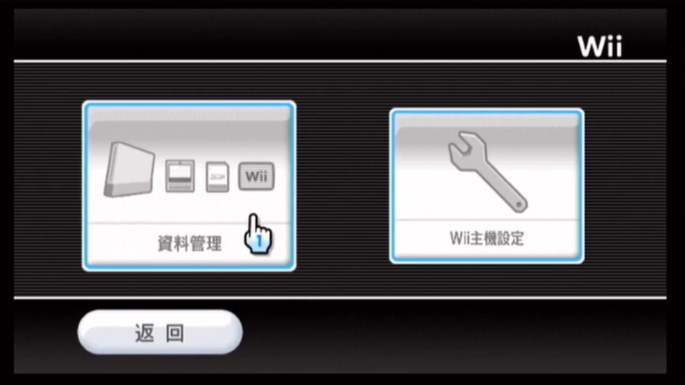
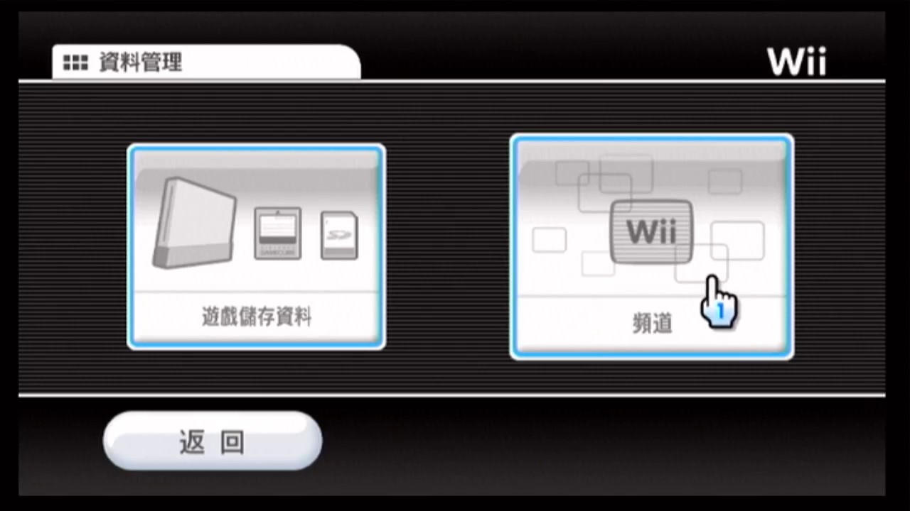
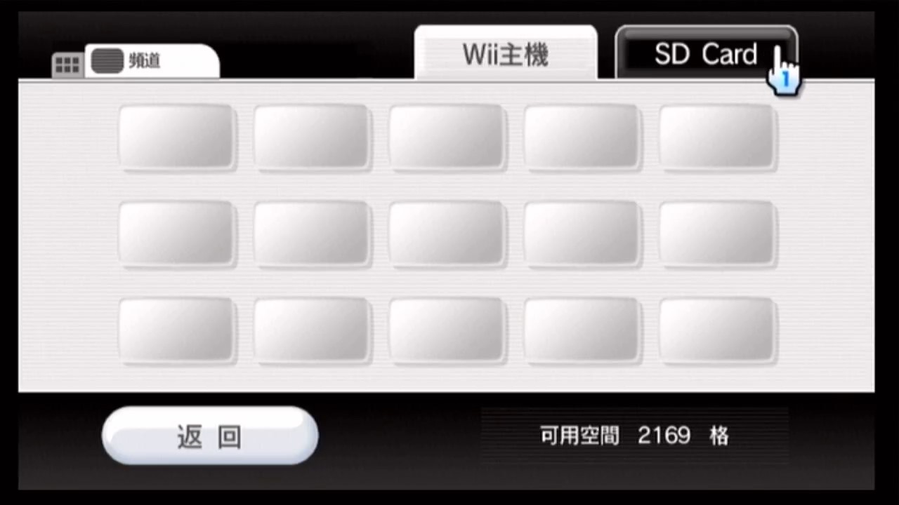
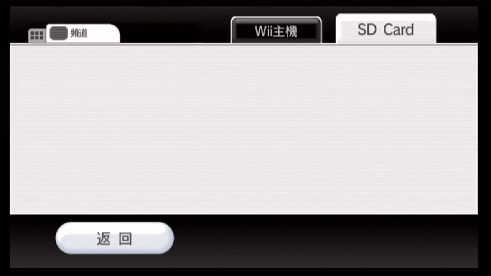
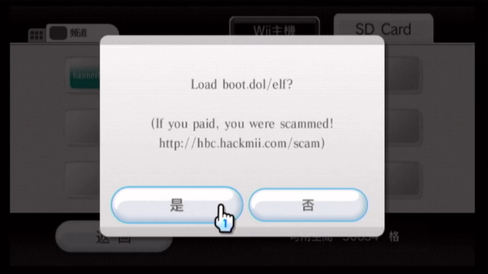

# 利用 Bannerbomb v1 漏洞安装 HBC  {#bannerbomb-v1}

## 一、背景知识

Wii 可以从 SD 卡读取频道的数据。如果事先将“特别的”频道数据文件拷贝到 SD 卡上，然后在 Wii 里面选择从 SD 卡读取频道，就能够触发 Bannerbomb 漏洞，漏洞会启动 SD 卡根目录下的 boot.dol 或者 boot.elf 文件。

Bannerbomb 漏洞有两个版本：

- 本文提到的 Bannerbomb v1 漏洞只适用于 4.1 及以下系统，任天堂在 4.2 系统修复了此漏洞；

- 4.2 系统可以利用 Bannerbomb v2 漏洞来安装 HBC，任天堂在 4.3 系统修复了此漏洞；

- 4.3 系统可以利用 LetterBomb 漏洞来安装 HBC。

## 二、相关文件

| 文件名 | 来源 | 说明 |
| --- | --- | --- |
| aad1f_v108.zip | <https://modmii.github.io> | 上文所说的“特别的”频道数据文件 |
| boot.elf | <https://bootmii.org/download/> | 来自 HackMii Installer v1.0，v1.0 能兼容 3.x 系统，而 v1.2 不兼容 |

## 三、注意事项

利用 Bannerbomb v1 漏洞安装 HBC 需要用到 SD 卡：

- 3.x 的系统不支持 SDHC，不能识别大于 2GB 的 SD 卡；

- 4.0 及以上的系统支持 SDHC，大于 2GB 的 SD 卡也能支持。

## 四、操作步骤

下面演示在 4.1J 系统中如何触发 Bannerbomb v1 漏洞:

1. 在系统主界面，点左下角的 Wii 按钮进入主机设定： 
  

2. 在主机设定界面，点左边的按钮进入资料管理： 
  

3. 在资料管理界面，点右边的按钮进入频道： 
  

4. 在频道界面，点 SD Card 标签： 
  

5. 耐心等待 Wii 从 SD 卡读取频道的数据： 
  

6. Bannerbomb v1 漏洞被触发之后，会出现下图的询问窗口，点左边的 [是] 按钮： 
  

7. 稍事等待，就能看到 HackMii Installer 的启动界面： 
  

8. 接下来请参考[《使用 HackMii Installer v1.0 安装 HBC》](@ref hackmii-installer-v10)一文中的操作步骤，完成 HBC 的安装。

## 五、参考链接

- <https://bannerbomb.qoid.us/index.old.php>
