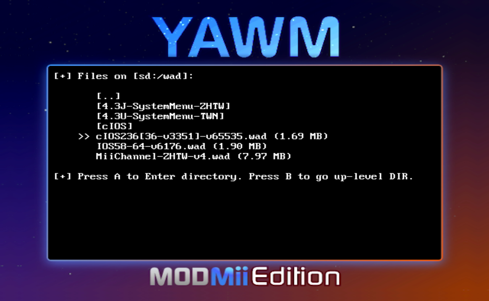

# Step 3: 安装 cIOS236  {#step3}

## 一、关于 IOS36 和 cIOS236

进行安装 IOS、安装系统菜单、安装/删除系统频道、安装 Priiloader 之类的操作，通常需要有较高的权限才能完成。IOS36 正好具备这样的高级权限。

cIOS236 是官方 IOS36 的补丁版本，它能够为自制 APP 提供稳定的高级权限。比如使用 cIOS236 来安装 .wad 文件，极少会出现安装失败的情况。其他推荐优先使用 cIOS236 的 APP 还有：

- Any Region Changer: 改区 APP；
- AnyTitle Deleter MOD: 删除系统频道；
- Priiloader: 防砖 APP。 

## 二、相关文件

| 文件 | 出处 |
| --- | --- |
| Multi-Mod Manager（以下简称 MMM） | <https://gbatemp.net/download/multi-mod-manager.13015> |
| IOS15-64-v257.wad | 通过 NUS Downloader 下载 |
| IOS15-64-v1032.wad | 通过 NUS Downloader 下载 |
| IOS36-64-v3608.wad | 通过 NUS Downloader 下载 |
| cIOS236[36-v3351]-v65535.wad | <https://modmii.github.io>  cIOS236 的安装文件，基于 IOS36-64-v3351 制作 |

## 三、注意事项

- 如果你的 Wii 和下图一样，-> Load another IOS 后面显示为 IOS236，说明你的 Wii 已经安装过 cIOS236，可以略过本文余下的内容，跳转到[《Step 4: 安装 IOS58》](@ref step4)继续操作： 
  

- IOS36-64-v3608.wad 是最新的 IOS36 安装文件，MMM 将基于它制作出 cIOS236；

- 如果你无法在 MMM 中完成 cIOS236 的安装，在 `apps/MMM` 文件夹里有一个 cIOS236 的安装文件（.wad 格式），请参考[《Step 2: 安装 USB Loader 使用的 cIOS》](@ref step2)中的操作步骤来安装 cIOS236，然后略过本文余下的内容，跳转到[《Step 4: 安装 IOS58》](@ref step4)继续操作： 
  

- MMM 启动之后，会优先选择 cIOS236 进行加载，这是在 SD 卡根目录下的 mmmconfig.txt 中设置的；

- Some YAWMM Mod 启动之后，也会优先选择 cIOS236 进行加载，这是在 wad 文件夹下的 wm_config.txt 中设置的。

## 四、安装步骤

1. 在 HBC 运行 MMM ： 
  

2. 先按遥控器手柄的方向键，使 -> 指向 Load another IOS，然后按 [A] 键： 
  

3. 先选中 249，然后按 [A] 键： 
  

4. 先按方向键，使 -> 指向 Install & Patch IOS36，然后按 [A] 键： 
  

5. 先确认 --> 指向 Express mode，然后按 [A] 键： 
  

6. 耐心等待安装结束： 
  

7. 按任意键回到 MMM 的主界面，可以看到当前使用的 IOS 为 IOS236: 
  

有了 cIOS236 的加持，我们可以使用 MMM 的 WAD Manager 或者 Some YAWMM Mod 来安装任何 .wad 文件，正如上文第 6 步最后的提示信息所言：

> You can use it to install anything now.
