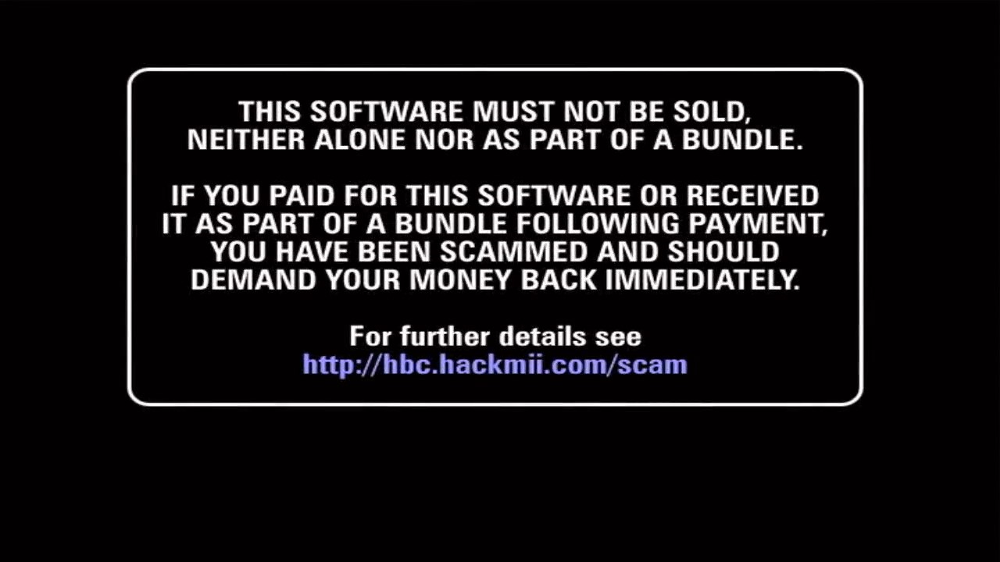

# 使用 HackMii Installer v1.0  {#hmiv1-0}

## 一、启动界面

HackMii Installer 启动之后会出现以下的界面：

正常情况下，等待 30 秒之后，界面下方就会出现提示语，按遥控器手柄的按键 [1] 继续：

## 二、检测结果界面

上图这个界面，展示了以下三项检测结果：

1. Using IOS versions 后面的数字可能是 37，也可能是其他数字，代表 HBC 安装之后会使用哪个 IOS 运行；

2. The Homebrew Channel 后面总是 Can be installed；

3. 市面上绝大部分机型的 BootMii 检测结果都是 Can only be installed as an IOS。

早期的日版 Wii 主机存在一个漏洞，姑且将其称为 boot2 漏洞。通过这个漏洞，我们可以使用 BootMii 在 Wii 上面安装欧美日韩任意一区，任意版本的系统，无障碍畅玩各区的游戏，而且还能够 100% 防砖。日本民间将这种机型的 Wii 称为： **神机** 。

下图为神机的检测结果界面：

检测结果界面没有其他操作入口，按 [A] 键继续。

## 三、安装 1.1.0 版本的 HBC

1. 先按方向键，选择 Install The Homebrew Channel，然后按 [A] 键： 
  

2. 选择 Yes, continue，按 [A] 键： 
  

3. 如果之前已经安装过 HBC，HackMii Installer 会先将其卸载，再开始安装 1.1.0 版本的 HBC。耐心等待安装结束，按 [A] 键： 
  

4. 选择 Exit，按 [A] 键，退出 HackMii Installer 之后会自动进入 HBC： 
  

5. 在 HBC 界面按 [HOME] 键，画面右上角会显示 HBC 的版本号为 1.1.0： 
  

## 四、安装 BootMii

后面我们还会把 HBC 升级到 1.1.2，到时再一起安装 BootMii。
