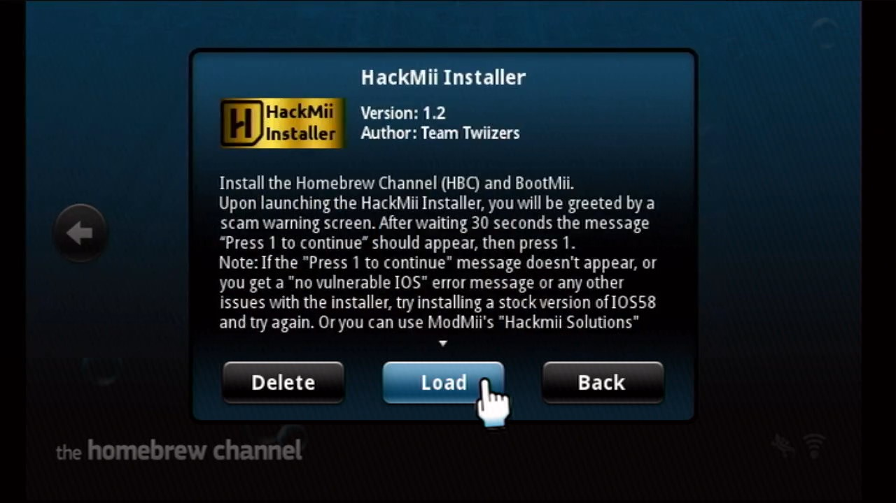
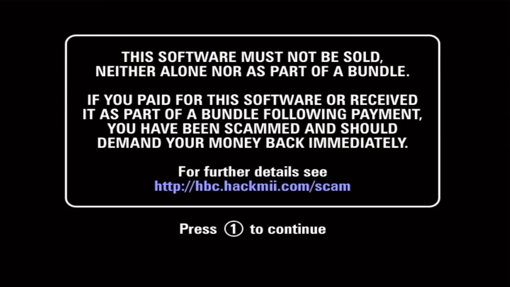
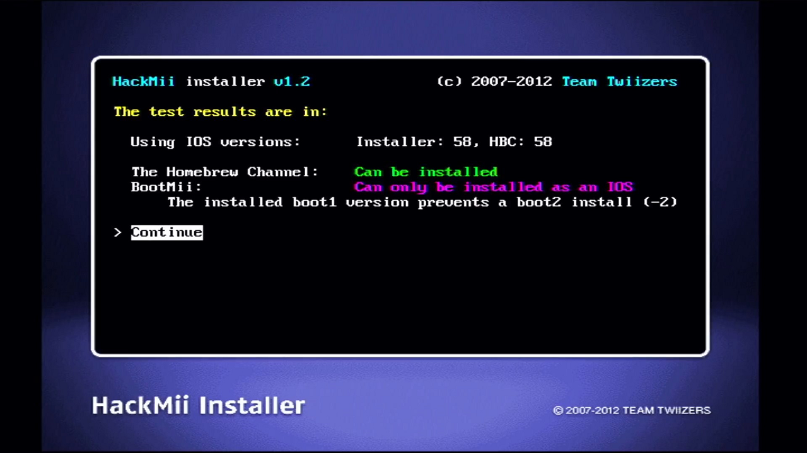
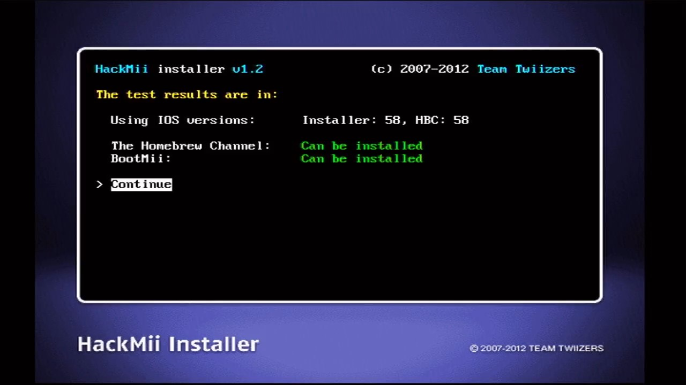
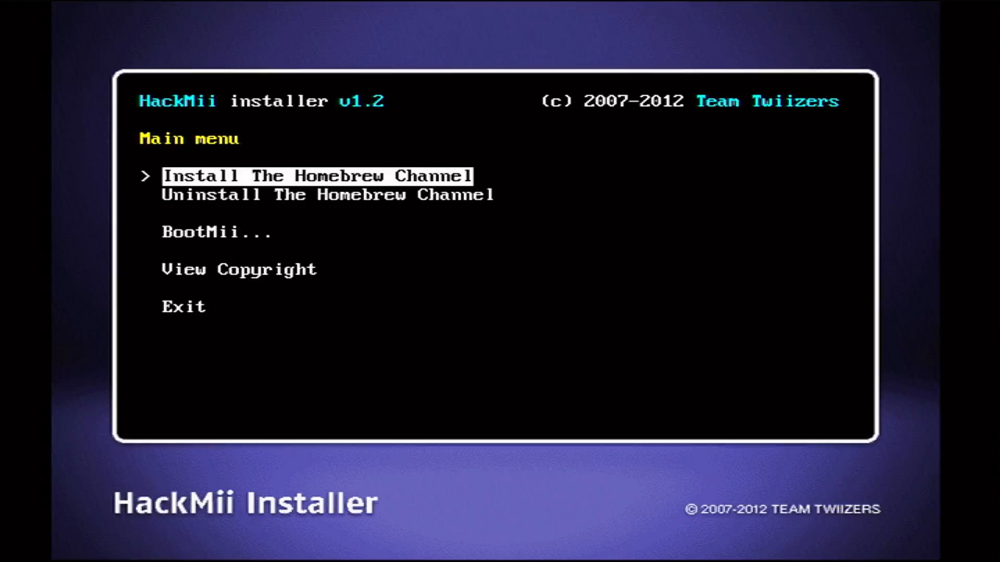
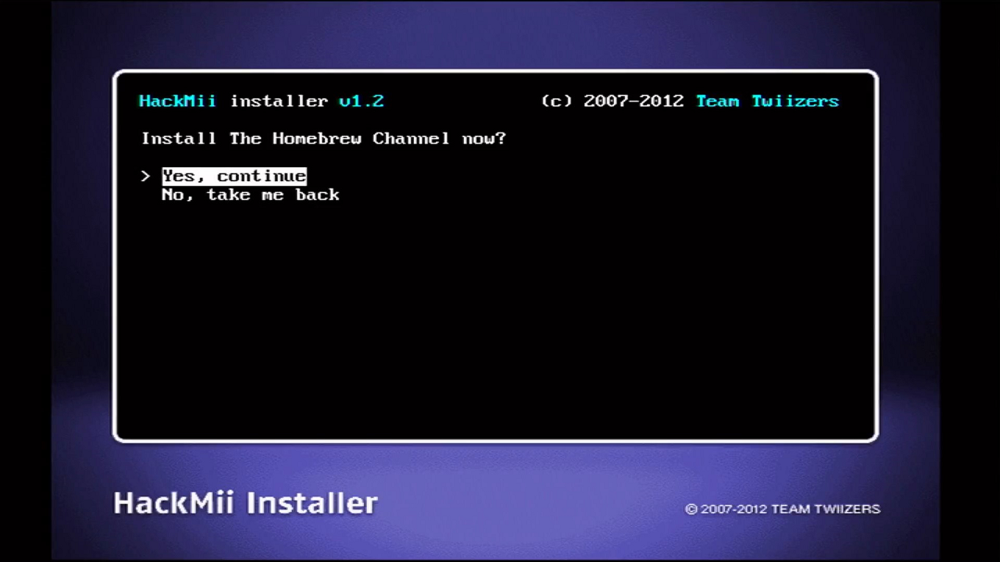
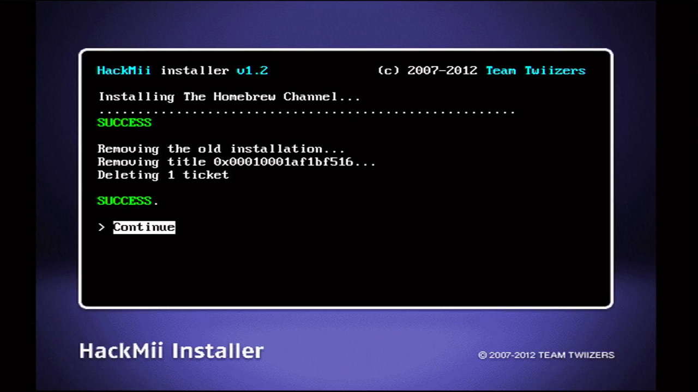
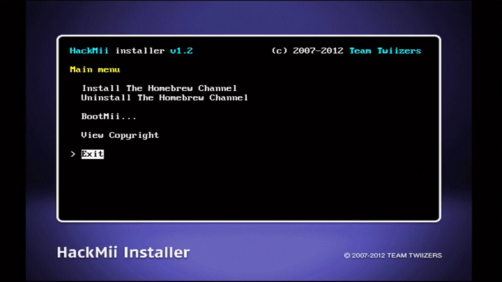
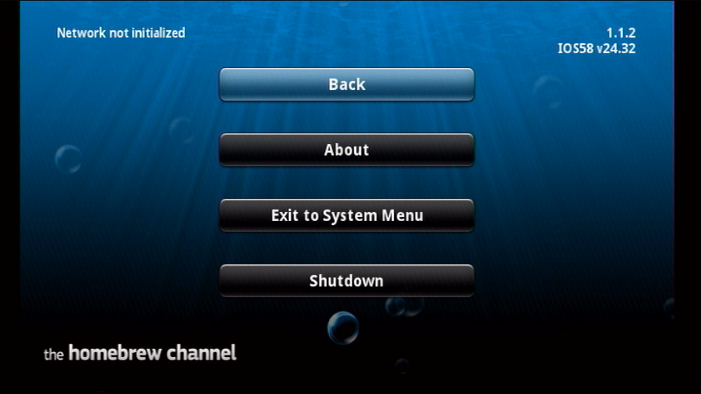

# Step 5: 安装 1.1.2 版本的 HBC  {#step5}

## 一、相关文件

| 文件 | 出处 |
| --- | --- |
| hackmii-installer-v1.2.zip | <https://bootmii.org/download/> |

## 二、安装 1.1.2 版本的 HBC

在[前面的教程](@ref hmiv1-0)中，已经详细讲解过如何使用 HackMii Installer v1.0 安装 1.1.0 版本的 HBC，操作步骤和使用 HackMii Installer v1.2 安装 1.1.2 版本的 HBC 几乎一模一样。因此，本文仅记录操作步骤，不再作重复的详细讲解。

1. 在 HBC 运行 HackMii Installer v1.2： 
  

2. 在以下界面耐心等待 30 秒： 
  

3. 看到界面下方出现提示语之后，按遥控器手柄的 [1] 号键继续：
  

4. 通过检测结果界面可以辨别 Wii 是属于普通机型还是神机，按 [A] 键继续：
  - 下图为普通机型的检测结果界面： 
    

  - 下图为神机的检测结果界面： 
    

5. 先按方向键，选择 Install The Homebrew Channel，然后按 [A] 键： 
  

6. 选择 Yes, continue，按 [A] 键： 
  

7. HackMii Installer 会先卸载 1.1.0 版本的 HBC，再开始安装 1.1.2 版本的 HBC。耐心等待安装结束，按 [A] 键： 
  

8. 选择 Exit，按 [A] 键，退出 HackMii Installer 之后会自动进入 HBC： 
  

9. 在 HBC 界面按 [HOME] 键，画面右上角会显示 HBC 的版本号为 1.1.2： 
  

1.1.2 版本的 HBC 和 IOS58 v24.32 的搭配才是绝配。
