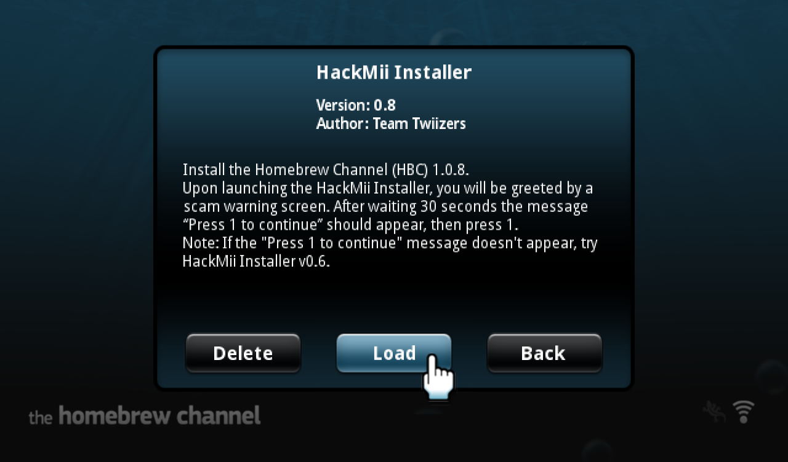
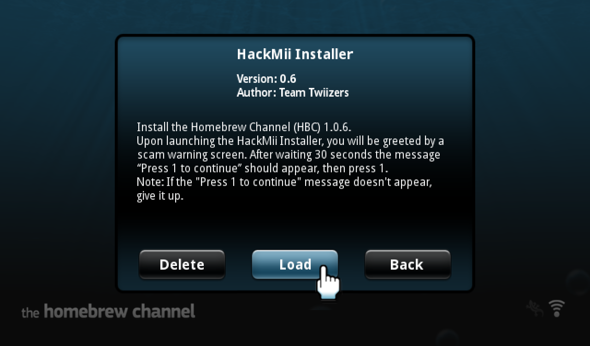
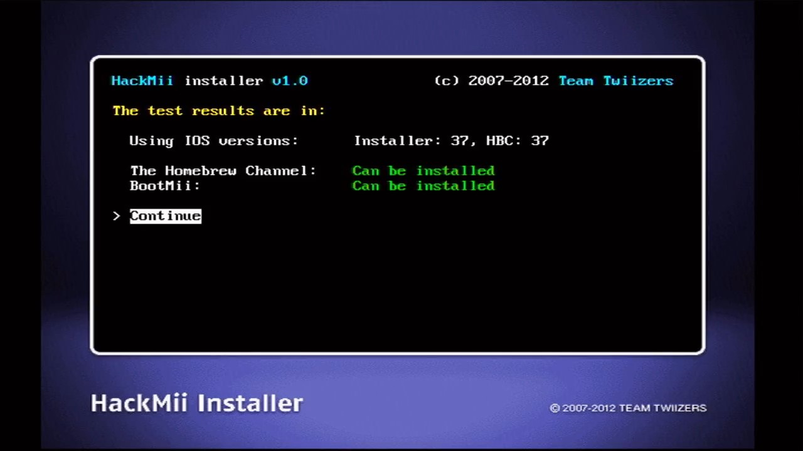
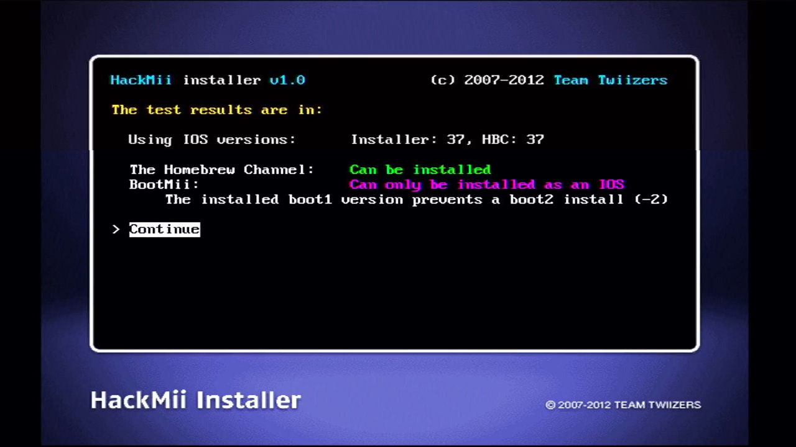
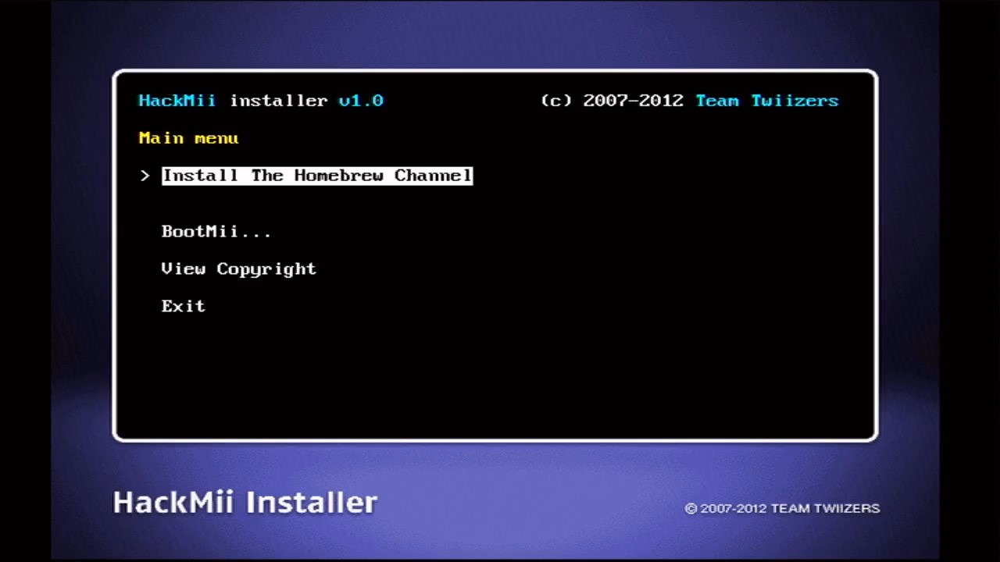
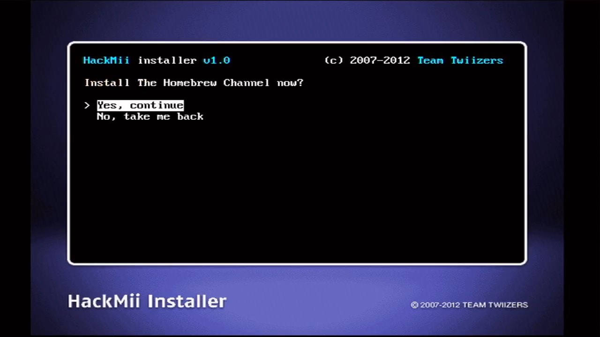
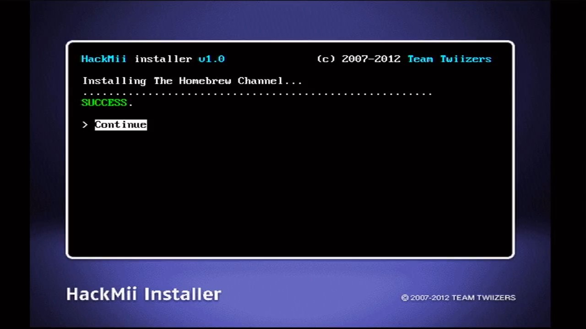
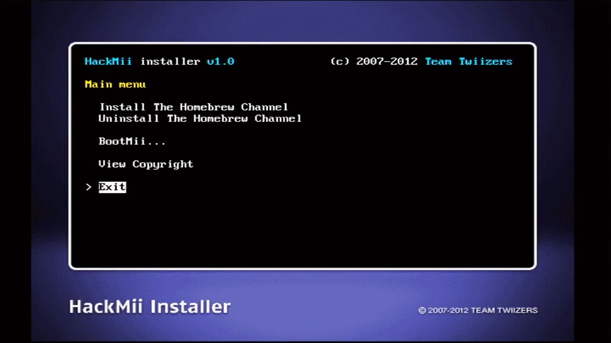
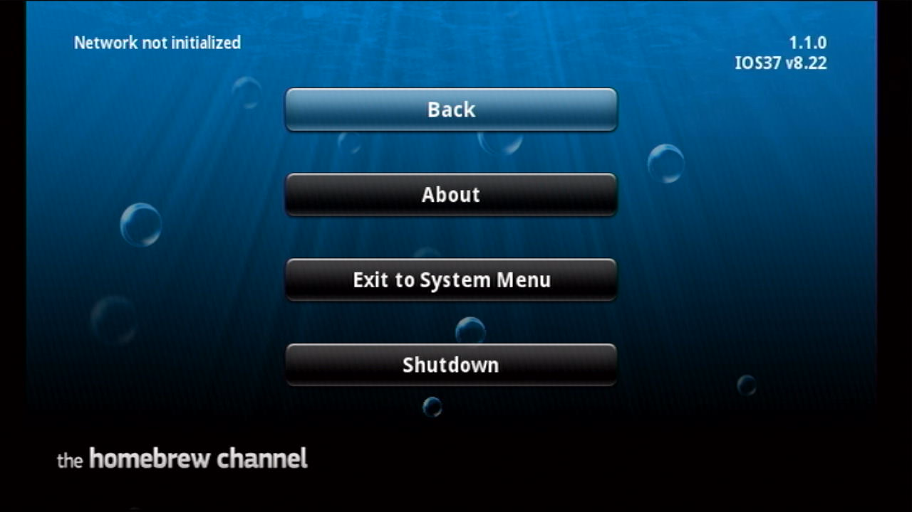

# 使用 HackMii Installer v1.0 安装 HBC {#hackmii-installer-v10}

## 一、启动界面

HackMii Installer 启动之后会出现以下的界面：

正常情况下，等待 30 秒之后，界面下方就会出现提示语：“Press [1] to continue”：

此时按遥控器手柄的 [1] 号键就会出现检测结果界面。

## 二、注意事项

HackMii Installer v1.0 在 3.2 或者更早期的版本上运行，可能会出现异常，比如提示当前系统不支持，又或者等待超过 30 秒却一直没有出现“Press [1] to continue”的提示语，无法继续操作。这通常是由于当前系统缺少 HBC 依赖的 IOS，可以改用 HackMii Installer v0.8 来进行后面的操作：

以此类推，如果 HackMii Installer v0.8 也出现异常，还可以改用 HackMii Installer v0.6：

如果 HackMii Installer v0.6 仍然出现异常，放弃吧。

## 三、检测结果界面

### A. 神机的检测结果界面

早期的 Wii 存在一个漏洞，姑且将其称为 boot2 漏洞。通过这个漏洞，我们可以使用 BootMii 在 Wii 上面安装欧美日韩任意一区，任意版本的系统，无障碍畅玩各区的游戏，而且还能够 100% 防砖。日本民间将这种机型的 Wii 称为： **神机** 。

上图为神机的检测结果界面，它展示了以下三项检测结果：

1. Using IOS versions 后面的数字可能是 37，也可能是其他数字，代表 HBC 安装之后会使用哪个 IOS 运行；

2. The Homebrew Channel 的检测结果总是 Can be installed；

3. 神机的 BootMii 检测结果总是 Can be installed。

### B. 普通机型的检测结果界面

市面上绝大部分机型都是普通机型，普通机型的 BootMii 检测结果总是 Can only be installed as an IOS。

检测结果界面没有其他操作入口，按 [A] 键继续。

## 四、安装 1.1.0 版的 HBC

1. 先按方向键，选择 Install The Homebrew Channel，然后按 [A] 键： 
  

2. 选择 Yes, continue，按 [A] 键： 
  

3. 如果之前已经安装过 HBC，HackMii Installer 会先将其卸载，再开始安装 1.1.0 版的 HBC。耐心等待安装结束，按 [A] 键： 
  

4. 选择 Exit，按 [A] 键，退出 HackMii Installer 之后会自动进入 HBC： 
  

5. 在 HBC 界面按 [HOME] 键，画面右上角显示 HBC 的版本为 1.1.0： 
  
