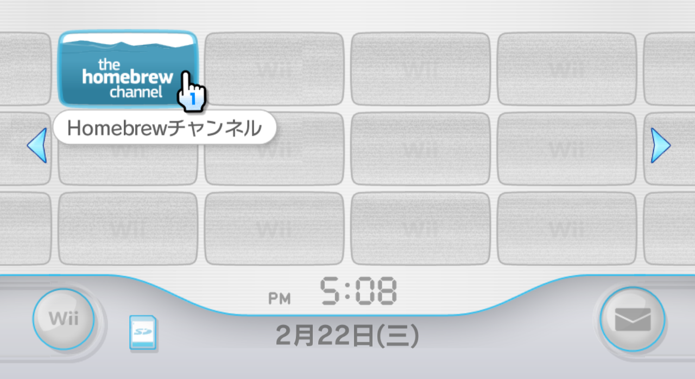
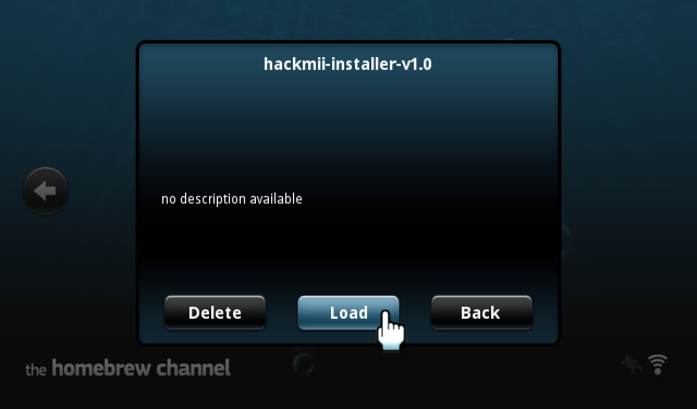

# Step 1: 安装 1.1.0 版本的 HBC  {#hbc-1-1-0}

HBC 是 Homebrew Channel 的缩写，一台 Wii 上面有没有安装 HBC，是这台 Wii 有没有做过破解的重要标志。

## 一、已经安装过 HBC 的 Wii

1. 通过系统主界面的频道图标打开 HBC： 
  

2. 在 HBC 界面按遥控器手柄的 [HOME] 键，画面右上角会显示 HBC 的版本号： 
  

3. 如果你的 HBC 已经是 1.1.0 或者 1.1.2 版本，可以略过本文余下的内容，跳转到[《Step 2: 安装 USB Loader 使用的 cIOS》](@ref step2)继续操作。

4. 如果你的 HBC 版本低于 1.1.0，请运行 hackmii-installer-v1.0 这个 APP 来升级： 
  

5. 接下来请参考[《使用 HackMii Installer v1.0》](@ref hmiv1-0)一文中的操作步骤，安装 1.1.0 版本的 HBC。

## 二、没有安装过 HBC 的 Wii

  

如果你的 Wii 没有上面图中的这个 HBC 频道图标，说明这台 Wii 还没有做过破解，请参考[《通过 Bannerbomb 漏洞安装 HBC》](@ref bannerbomb-v1)，继续后面的操作。
