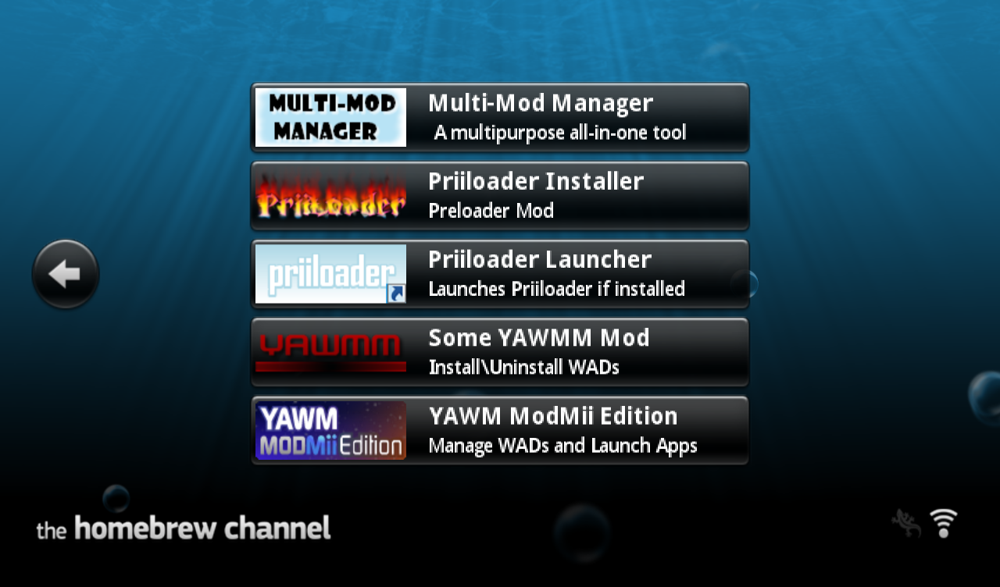
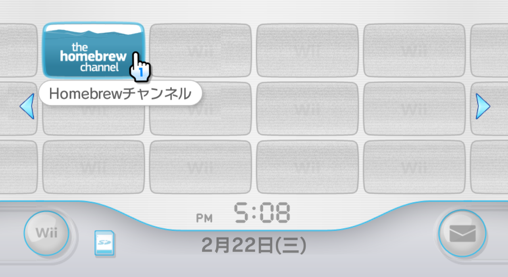
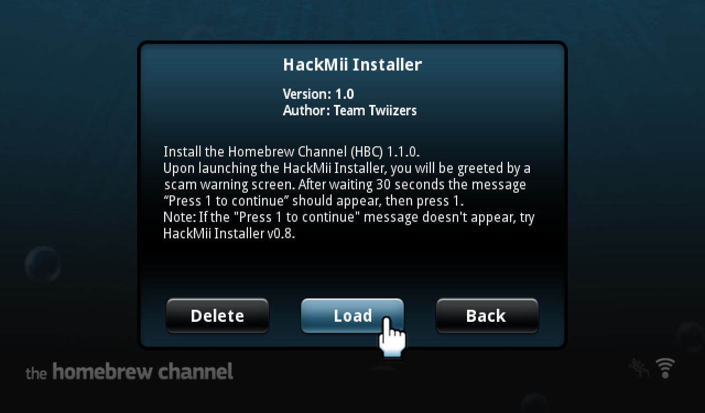

# Step 1: 安装 1.1.0 版的 HBC  {#hbc-v110}

HBC 是 Homebrew Channel 的缩写。在 Wii 上面安装游戏、玩游戏、修改系统……经常要用到各种各样的 APP，一般情况下，我们需要通过 HBC 来启动这些 APP。

在 HBC 的界面，我们能够看到 SD 卡或者 USB 设备（根目录 > `apps` 文件夹）里的所有自制 APP： 
  

> 一台 Wii 有没有安装 HBC，是这台 Wii 有没有做过破解的重要标志。

## 一、如果你的 Wii 已经安装了 HBC

1. 如果你的 Wii 已经安装了 HBC，直接通过系统主界面的“蓝色波浪”频道图标打开 HBC 即可： 
  

2. 在 HBC 界面按遥控器手柄的 [HOME] 键，画面右上角会显示 HBC 的版本号： 
  

3. 如果你的 HBC 已经是 1.1.0 或者 1.1.2 版本，可以略过本文余下的内容，跳转到[《Step 2: 安装 USB Loader 使用的 cIOS》](@ref step2)继续操作。

4. 如果你的 HBC 版本低于 1.1.0，请运行 HackMii Installer v1.0 来升级 HBC： 
  

5. 接下来请参考[《使用 HackMii Installer v1.0 安装 HBC》](@ref hackmii-installer-v10)一文中的操作步骤，完成 HBC 的升级。

## 二、如果你的 Wii 没有安装 HBC

如果你在系统主界面找不到“蓝色波浪”的频道图标，说明你的 Wii 没有安装 HBC。4.1 及以下系统可以通过一个叫 Bannerbomb 的系统漏洞来安装 HBC，详细操作请参考[《通过 Bannerbomb v1 漏洞安装 HBC》](@ref bannerbomb-v1)。
