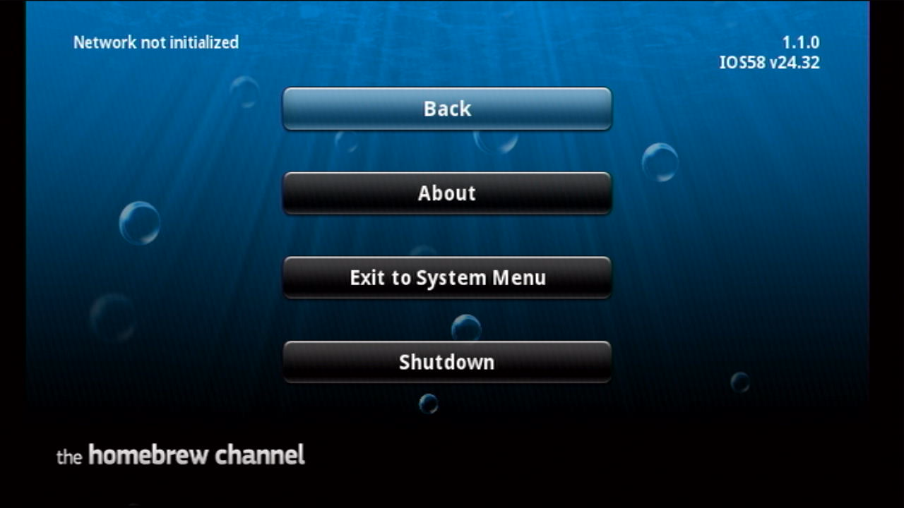
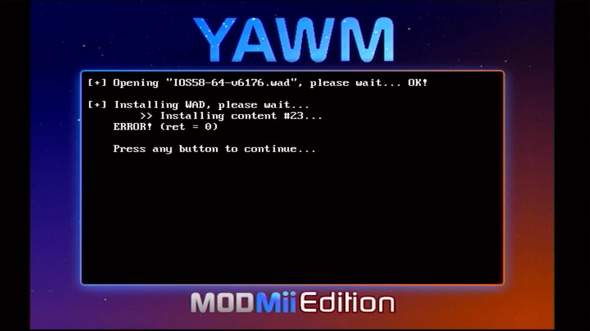
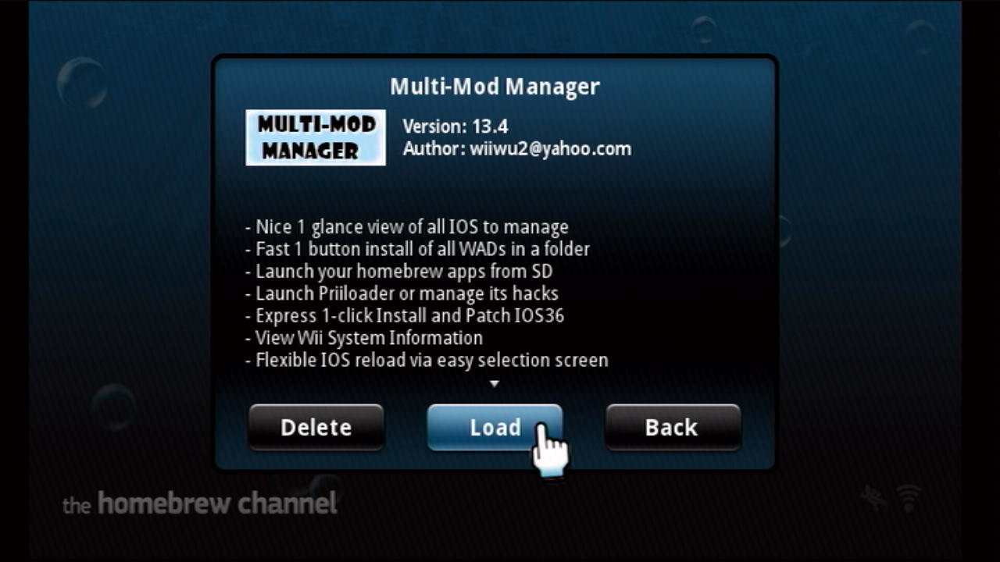
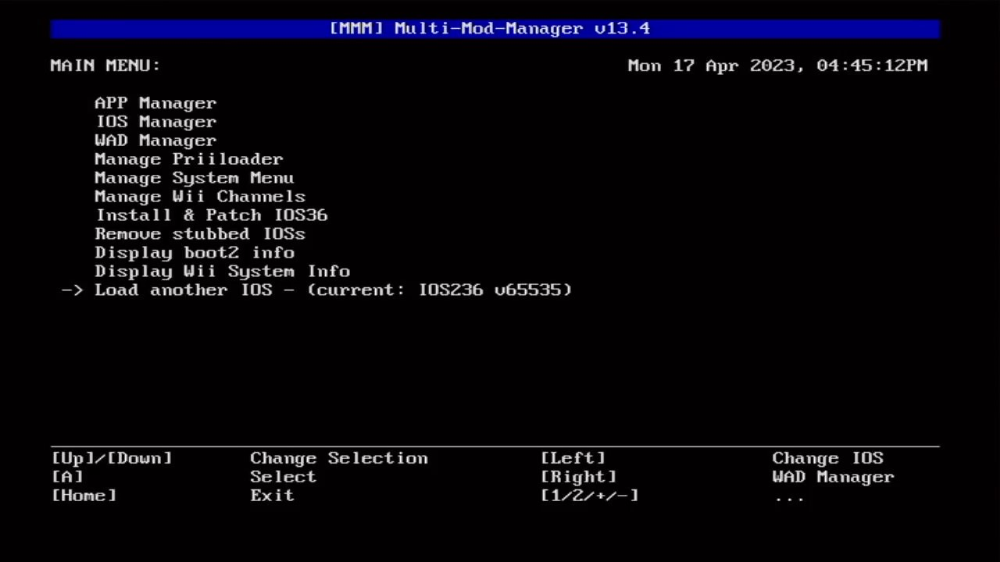
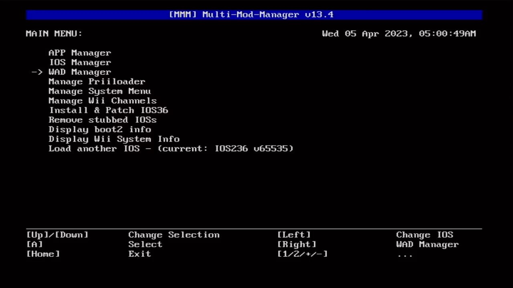
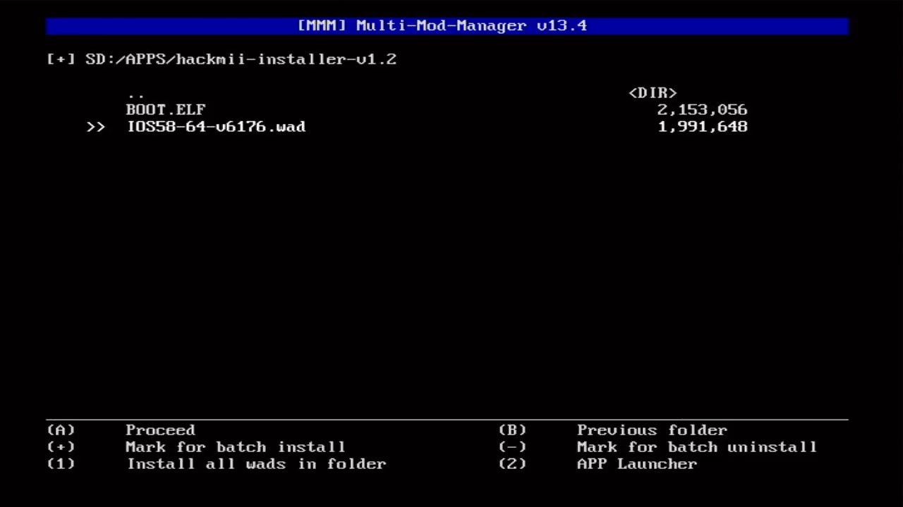
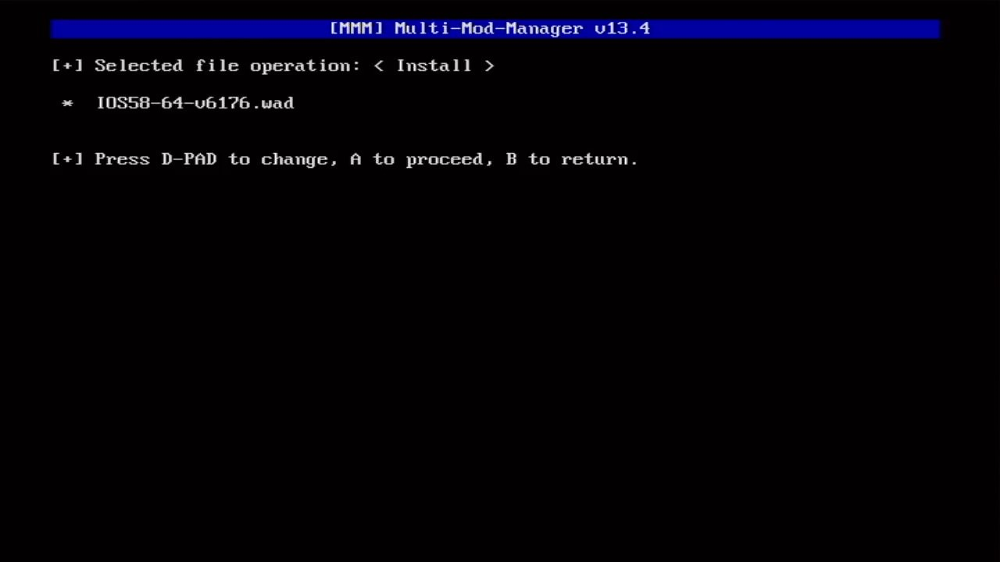
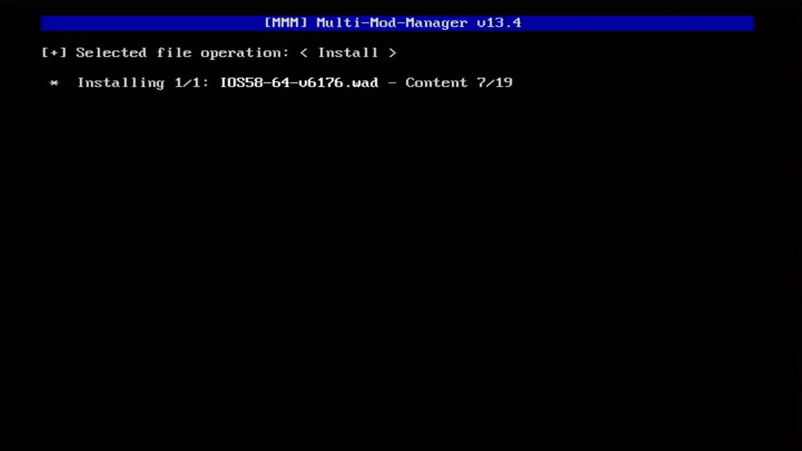
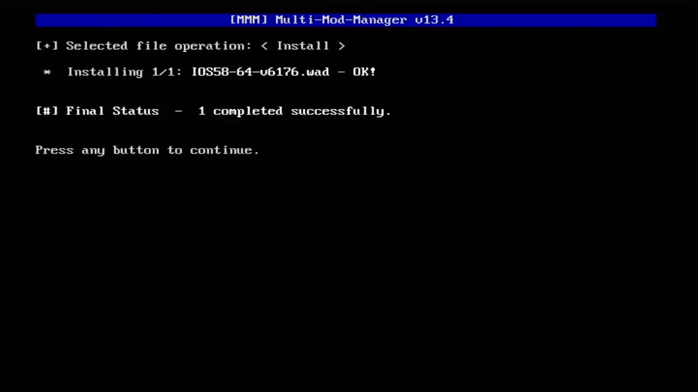

# Step 4: 安装 IOS58  {#step4}

## 一、关于 IOS58

IOS58 是 4.3 系统新增加的系统级 IOS，它全面支持 USB2.0 协议，因此可以支持更大容量的 SD 卡，读写速度更快，传输更稳定。总之任天堂就是这么吹的，至于你信不信，我反正信了。

## 二、相关文件

| 文件 | 出处 |
| --- | --- |
| IOS58-64-v6176.wad | 通过 NUS Downloader 下载 |

## 三、注意事项

- 在 HBC 界面按遥控器手柄的 [HOME] 键，画面右上角会显示 HBC 正在使用的 IOS。如果你的 Wii 和下图一样，显示为 IOS58 v24.32，说明你的 Wii 已经安装了最新的 IOS58，可以直接略过本文余下的内容，直接跳转到[《Step 5: 把 HBC 升级到 1.1.2 版本》](@ref step5)，继续后面的操作： 
  

- 安装 IOS58 这样的系统级 IOS，一般 WAD 安装工具可能会因为权限不足而失败，如下图所示： 
  

## 四、操作步骤

1. 在 HBC 运行 MMM ： 
  

2. 如下图所示，确认 -> Load another IOS 这一行后面的内容是 IOS236： 
  

3. 先按遥控器手柄的方向键，使 -> 指向 WAD Manager，然后按 [A] 键： 
  

4. 进入 `apps/hackmii-installer-v1.2` 文件夹，按遥控器手柄的方向键，使 >> 指向 IOS58-64-v6176.wad，然后按 [A] 键： 
  

5. 按 [A] 键继续： 
  

6. 耐心等待安装结束： 
  
  
7. 看到以下界面即表示安装成功： 
  

8. 按两下 [HOME] 键退出 APP。
