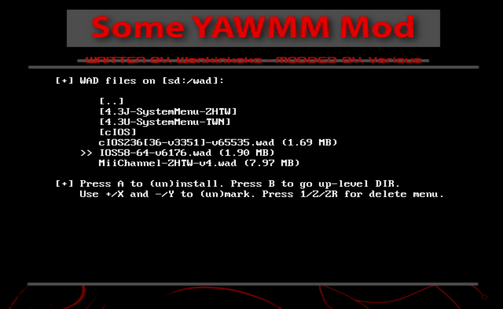

# Step 4: 安装 IOS58  {#step4}

## 一、关于 IOS58

IOS58 是 4.3 系统新增加的系统级 IOS，它全面支持 USB2.0 协议，因此可以支持更大容量的 SD 卡，读写速度更快，传输更稳定。总之任天堂就是这么吹的，至于你信不信，我反正信了。

## 二、相关文件

| 文件 | 出处 |
| --- | --- |
| IOS58-64-v6176.wad | 通过 NUS Downloader 下载 |

## 三、注意事项

- 在 HBC 界面按遥控器手柄的 [HOME] 键，画面右上角会显示 HBC 正在使用的 IOS。如果你的 Wii 和下图一样，显示为 IOS58 v24.32，说明你的 Wii 已经安装了最新的 IOS58，可以略过本文余下的内容，跳转到[《Step 5: 安装 1.1.2 版本的 HBC》](@ref step5)继续操作： 
  

- 安装 IOS58 这样的系统级 IOS，APP 需要靠 cIOS236 提供高级权限，否则就会像 YAWM ModMii Edition 一样，因为权限不足而失败，如下图所示： 
  

- 以下两种安装 IOS58 的方法，方法1可以选择 SD 卡或 USB 设备，而方法2只能支持 SD 卡。

## 四、安装方法1：使用 Some YAWMM Mod 安装 IOS58 

Some YAWMM Mod 启动之后，会优先选择 cIOS236 进行加载，这是在 wad 文件夹里的 wm_config.txt 中设置的。使用 Some YAWMM Mod 来安装 `wad` 文件夹里的 IOS58-64-v6176.wad，可参考[《安装 USB Loader 使用的 cIOS（2022 版）》](@ref some-yawmm-mod)中的操作步骤：

## 五、安装方法2：使用 MMM 安装 IOS58

MMM 启动之后，也会优先选择 cIOS236 进行加载，这是在 SD 卡根目录下的 mmmconfig.txt 中设置的。

以下为使用 MMM 安装 IOS58-64-v6176.wad 的操作步骤：

1. 在 HBC 运行 MMM ： 
  

2. 如下图所示，确认 -> Load another IOS 这一行后面的内容是 IOS236： 
  

3. 先按遥控器手柄的方向键，使 -> 指向 WAD Manager，然后按 [A] 键： 
  

4. 进入 `wad` 文件夹，按方向键，使 >> 指向 IOS58-64-v6176.wad，然后按 [A] 键： 
  

5. 按 [A] 键继续： 
  

6. 耐心等待安装结束： 
  
  
7. 看到以下界面即表示安装成功： 
  

8. 按两下 [HOME] 键退出 APP。
