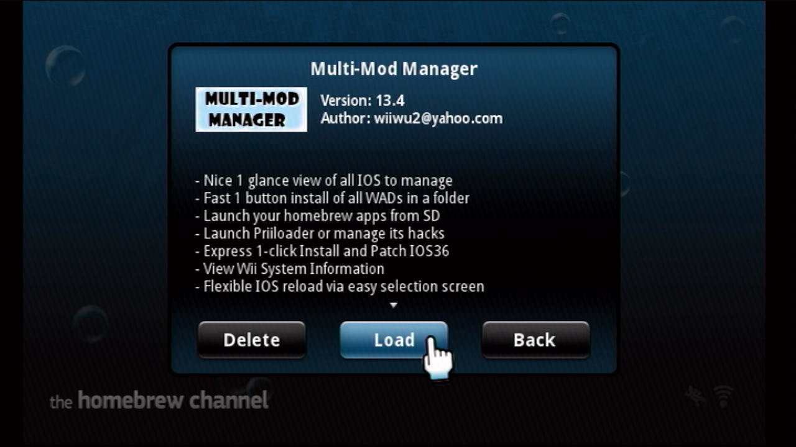
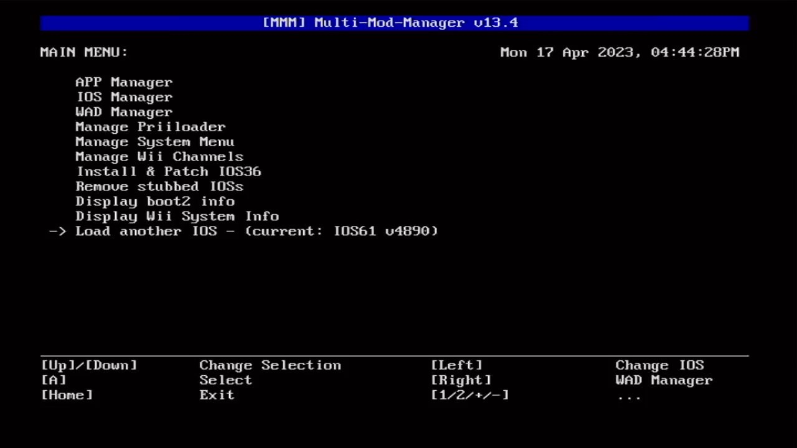
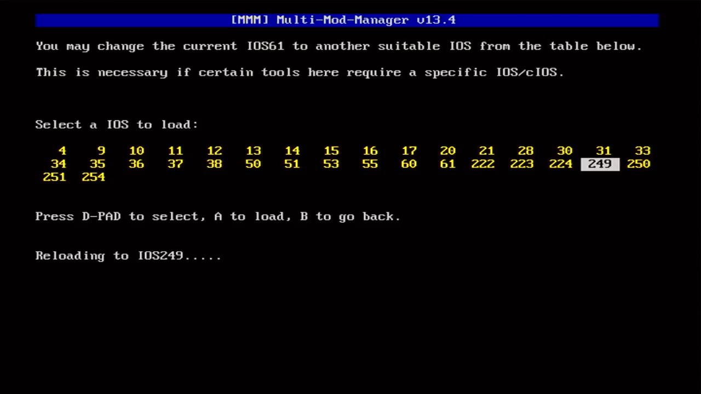
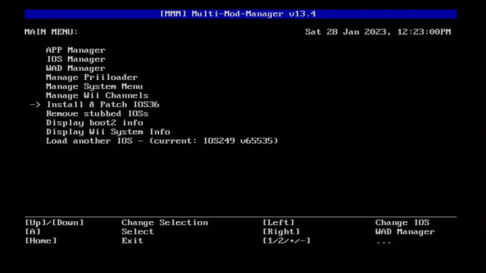
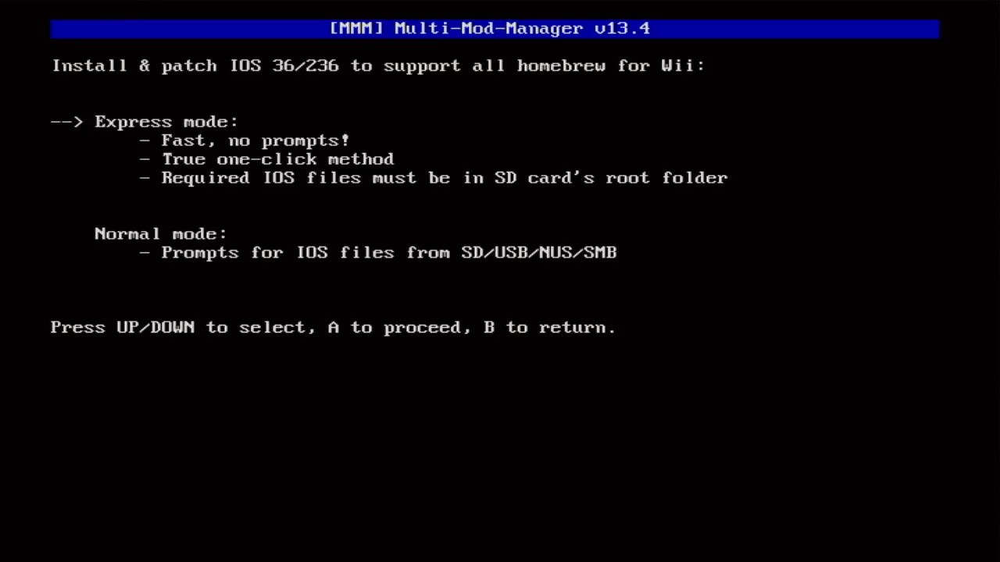
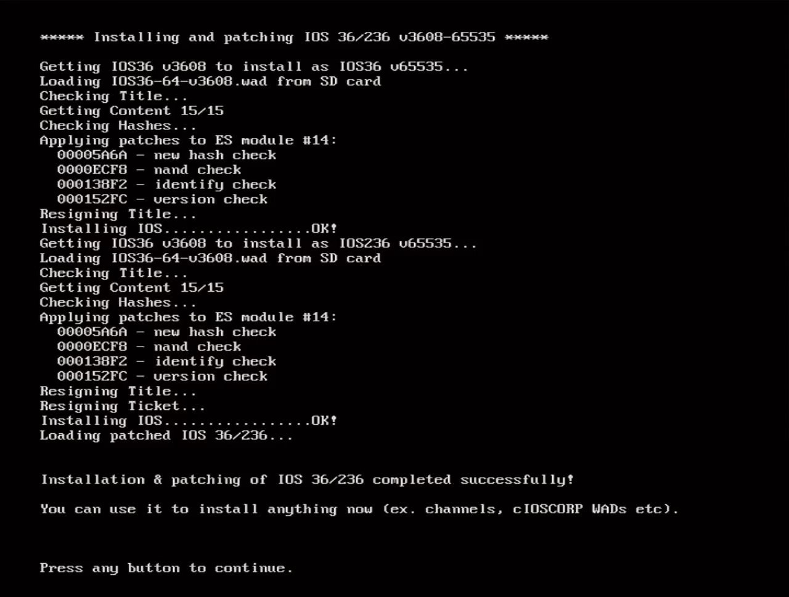

# Step 3: 安装 cIOS236  {#step3}

本文重在阐述安装步骤，相关知识点请参考[《IOS36 和 cIOS236》](../cios236/README.md)。

## 一、相关文件

| 文件 | 出处 |
| --- | --- |
| Multi-Mod Manager（以下简称 MMM） | <https://gbatemp.net/download/multi-mod-manager.13015> |
| IOS15-64-v257.wad | 通过 NUS Downloader 下载 |
| IOS15-64-v1032.wad | 通过 NUS Downloader 下载 |
| IOS36-64-v3608.wad | 通过 NUS Downloader 下载 |

## 二、安装步骤

1. 在 HBC 运行 MMM ： 
  

2. 先按遥控器手柄的方向键，使 -> 指向 Load another IOS，然后按 [A] 键： 
  

3. 先选中 249，然后按 [A] 键： 
  

4. 先按遥控器手柄的方向键，使 -> 指向 Install & Patch IOS36，然后按 [A] 键： 
  

5. 先确认 --> 指向 Express mode，然后按 [A] 键： 
  

6. 耐心等待安装结束： 
  

7. 按任意键回到 MMM 的主界面，可以看到使用的 IOS 变成了 IOS236: 
  

有了 cIOS236 的加持，我们可以使用 MMM 的 WAD Manager 来安装任何 .wad 文件，正如上文第 6 步最后的提示信息所言：

> You can use it to install anything now.
