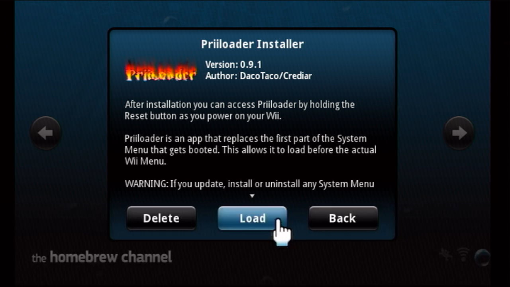
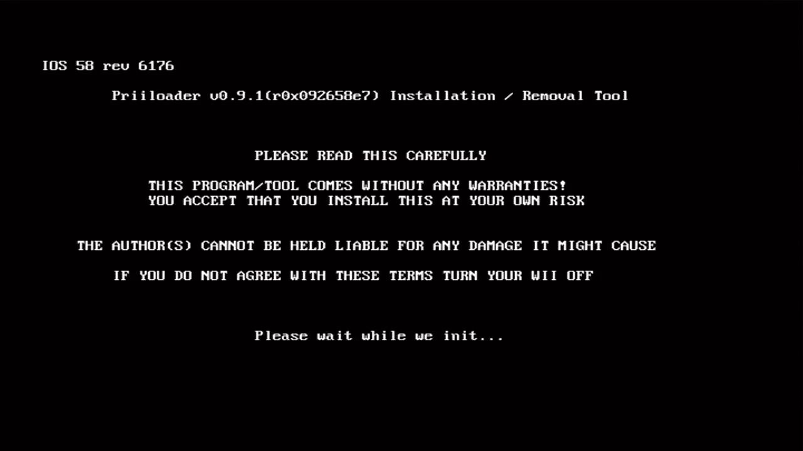
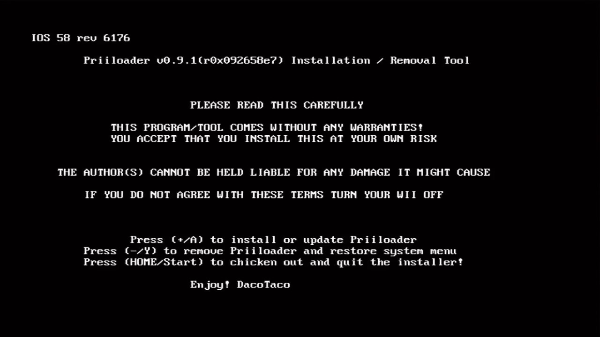
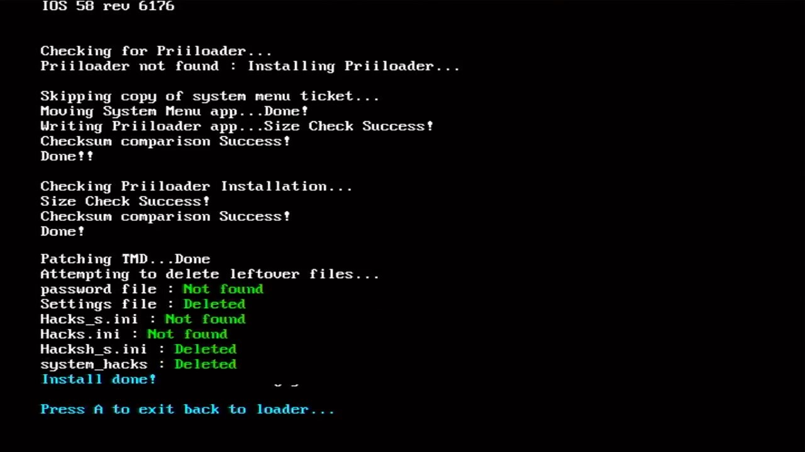

# 安装 Priiloader  {#priiloader-installer}

## 一、相关文件

| 文件 | 出处 |
| --- | --- |
| Priiloader Installer | <https://modmii.github.io> |
| Priiloader Launcher | <https://modmii.github.io> |
| hacks_hash.ini | <https://github.com/DacoTaco/priiloader> |

## 二、注意事项

安装系统菜单的时候，会自动删除已经安装好的 Priiloader 和相关设置。为了保护你的 Wii 不会变砖，安装完系统菜单之后，请第一时间重装 Priiloader。

## 三、操作步骤

1. 在 HBC 运行 Priiloader Installer：  
  

2. 稍事等待： 
  

3. 看到以下界面之后，按遥控器手柄的 [+] 号键启动安装：
  

4. 看到以下界面即表示安装成功，按 [A] 键退出 APP： 
  

5. 请回到[《Step 6: 安装 4.3 中文系统菜单》](@ref system-menu-4-3)作安装系统菜单后的最终确认。
