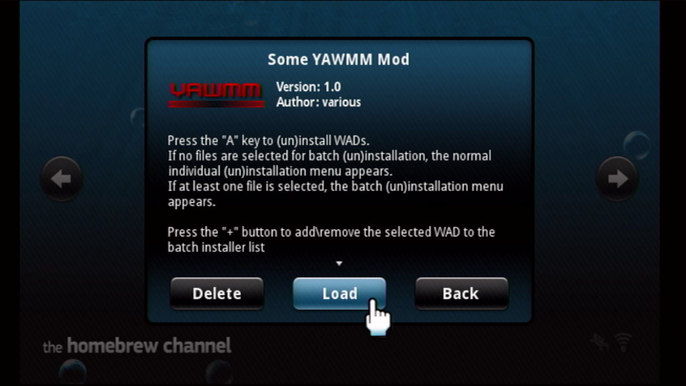
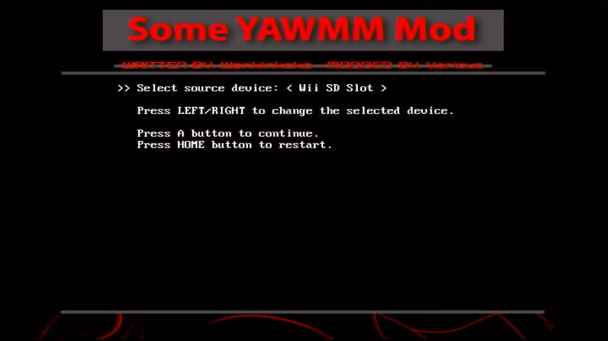
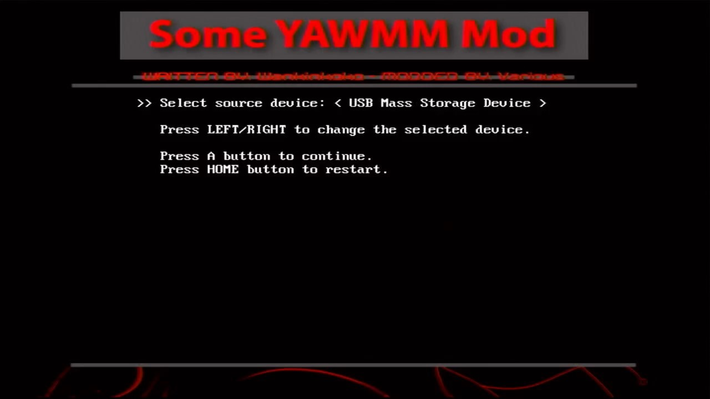
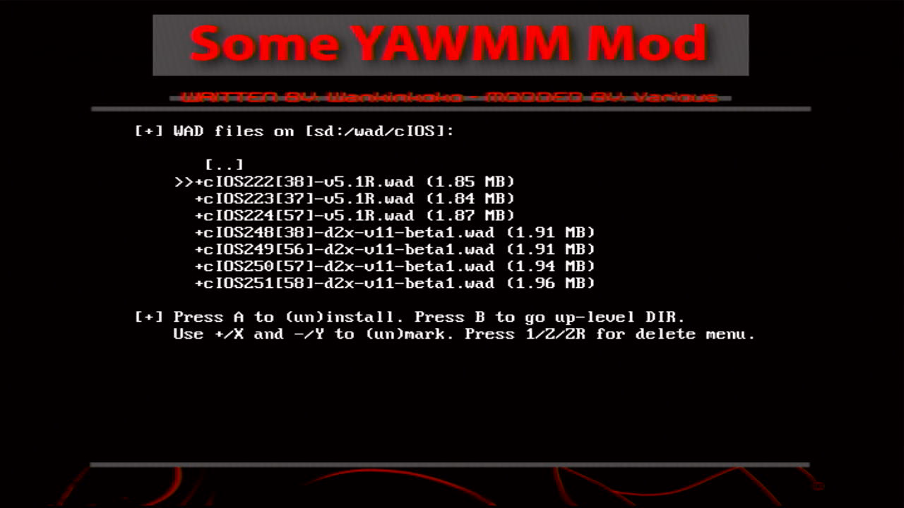
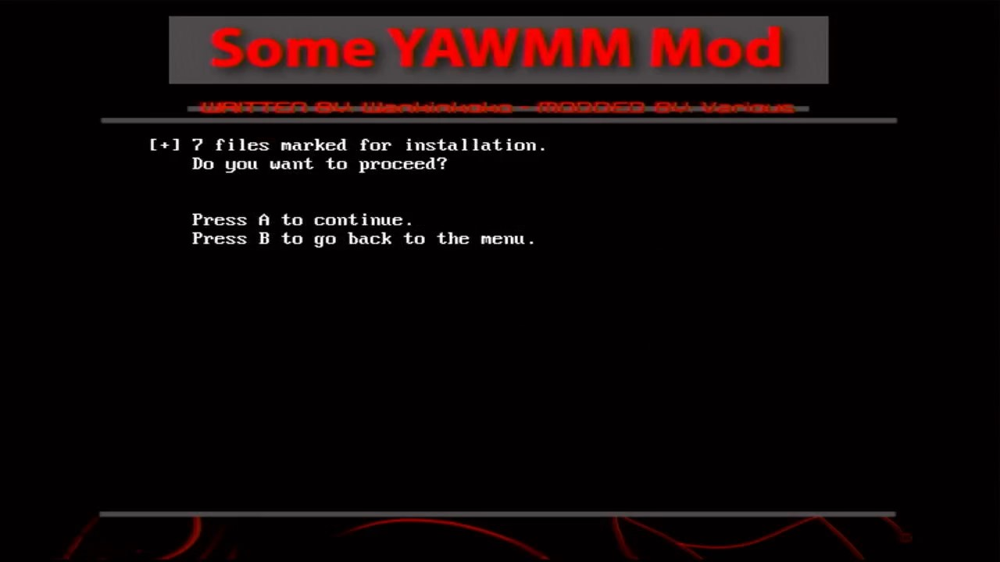
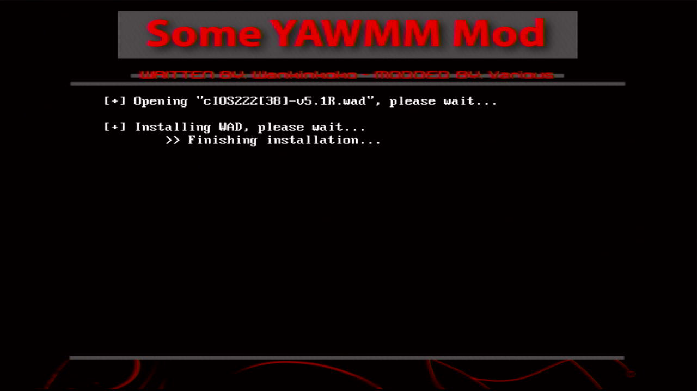
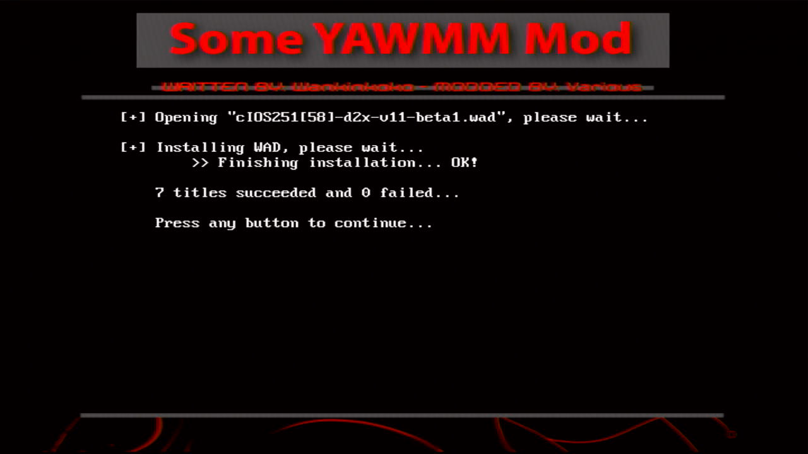

# 安装 USB Loader 使用的 cIOS（2022 版）  {#some-yawmm-mod}

## 一、相关文件

| 文件 | 出处 |
| --- | --- |
| **Some YAWMM Mod** | <https://github.com/FIX94/Some-YAWMM-Mod> |
| 7 个 cIOS 安装文件（.wad 格式） | <https://modmii.github.io> |

## 二、注意事项

本文重在阐述安装步骤，相关知识点请参考[《USB Loader 使用的 cIOS》](../cios-for-usb-loader/README.md)；

## 三、安装步骤

1. 在 **HBC** 运行 **Some YAWMM Mod** ： 
  

2. 一般情况下，APP 启动之后会进入 **Select source device** 界面：
    - 通过 SD 卡安装的，选择 **Wii SD Slot** ： 
    
    - 通过 USB 设备安装的，选择 **USB Mass Storage Device** ： 
    

3. 进入 `wad/cIOS` 文件夹，可以看到 7 个 cIOS 对应的 .wad 文件，如下图所示： 
  

4. 先按遥控器手柄的方向键，使 >> 指向第一个 .wad 文件，然后按住 [+] 号键不放，等所有 .wad 文件名称前面出现 + 号之后再松开，最后按 [A] 键启动安装；

5. 按 [A] 键继续： 
  

6. 耐心等待安装结束： 
  

7. 看到以下界面即表示安装成功： 
  

8. 按两下 [HOME] 键退出 APP。 
