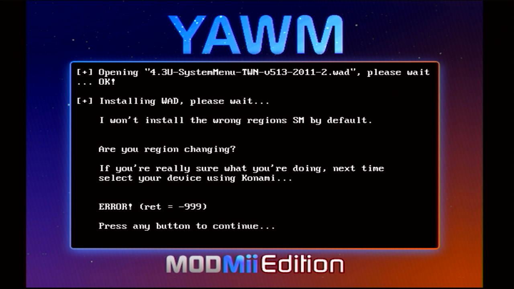
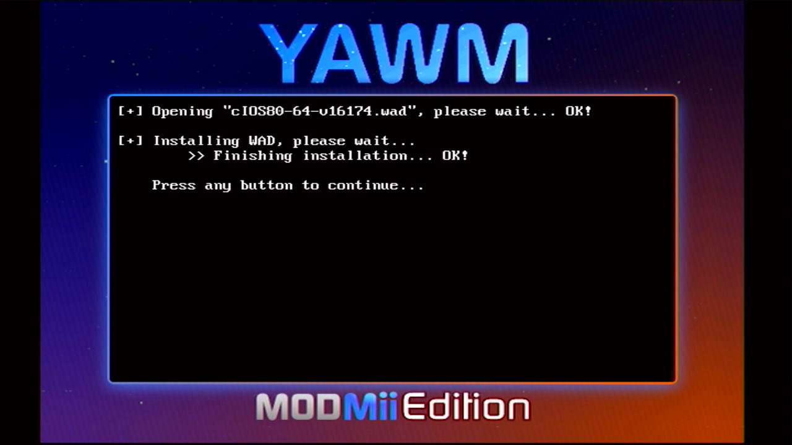
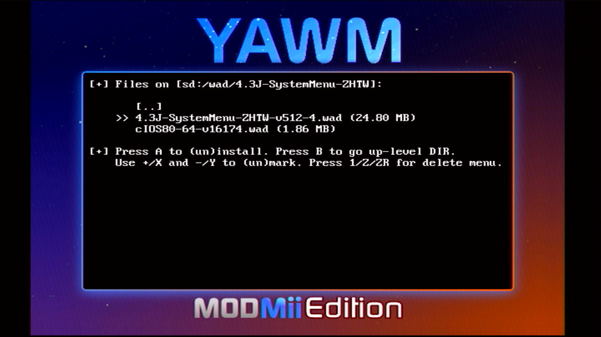
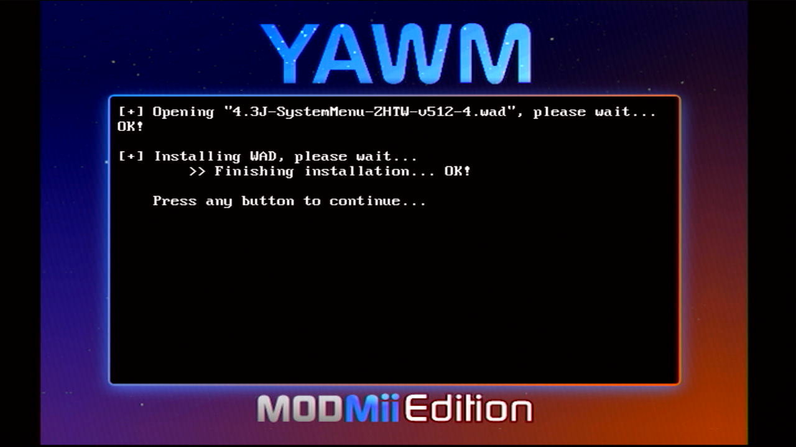
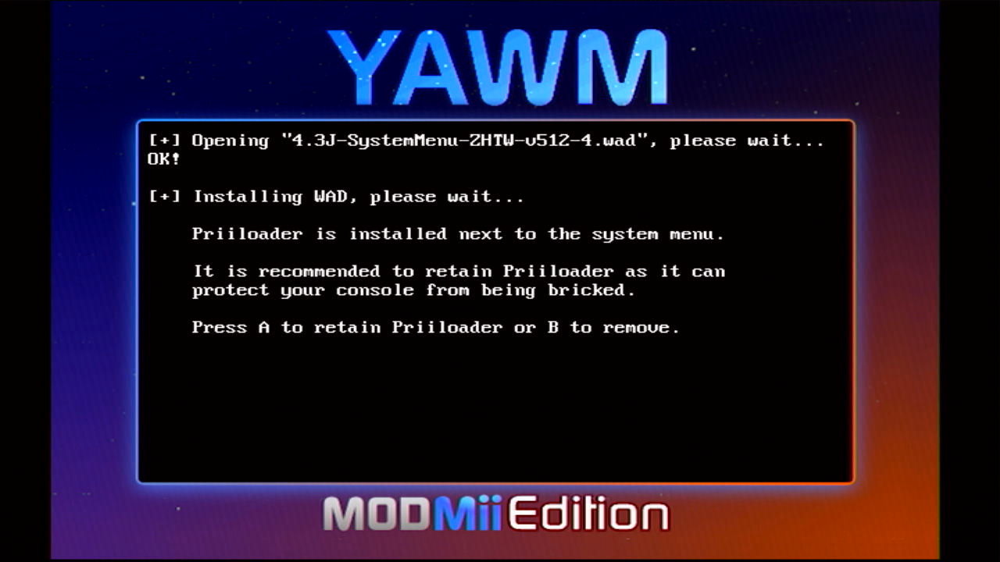
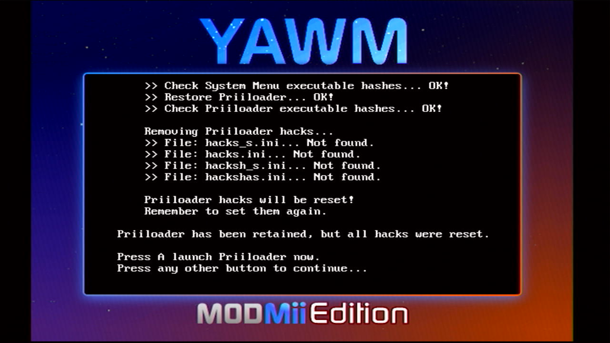
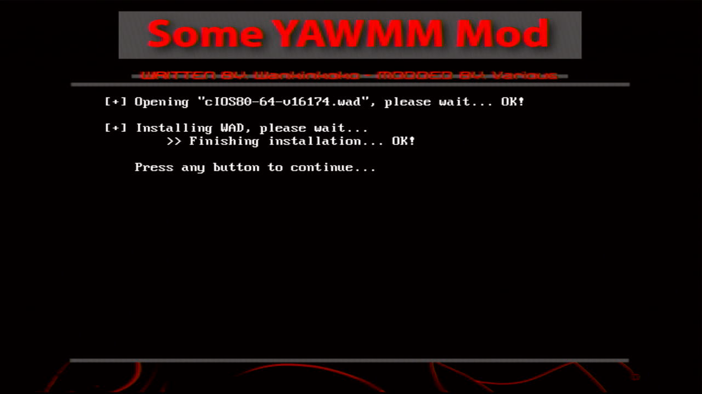
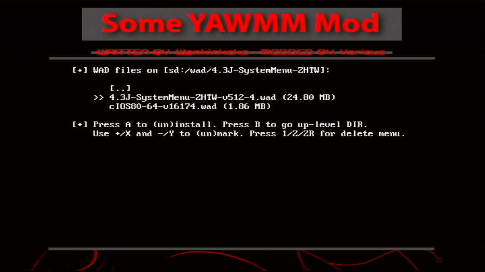
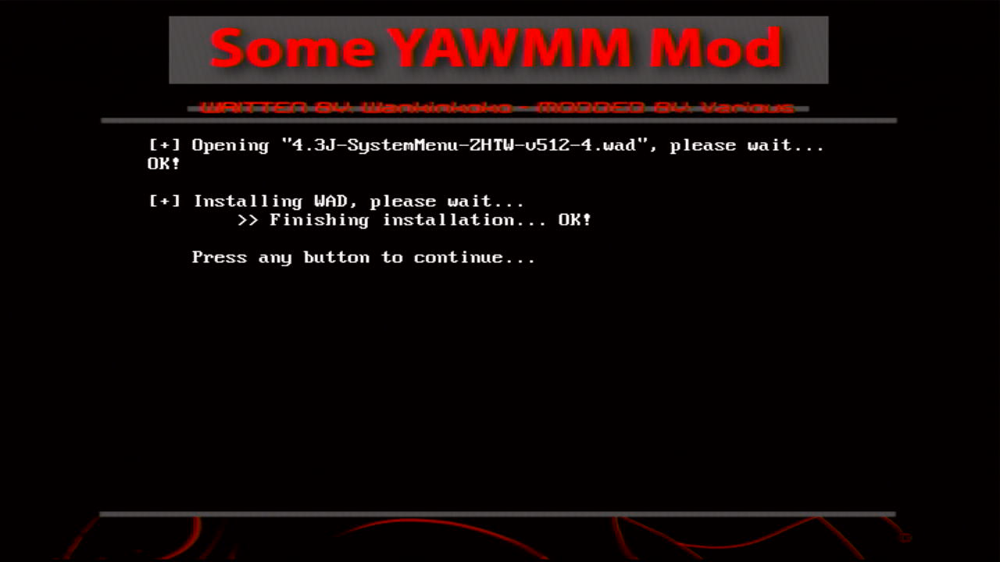

# 日版系统安装 4.3J 中文系统菜单  {#system-menu-4-3j-zhtw}

## 一、本文适用的系统版本

如果你的 Wii 不是日版系统，请回到[《Step 6: 安装 4.3 中文系统菜单》](@ref system-menu-4-3)重新选择匹配的教程再继续。

本文只适用于已经安装了日版系统的 Wii，这些系统包括：4.3J、4.2J、4.1J、4.0J、3.4J、3.3J、3.2J、3.1J、3.0J。

## 二、相关文件

| 文件 | 出处 |
| --- | --- |
| 4.3J-SystemMenu-ZHTW-v512-4.wad | 由 UP 主馬到成功制作 |
| cIOS80-64-v16174.wad | 4.3 中文系统菜单必须搭配此 cIOS80 版本 |
| YAWM ModMii Edition | <https://github.com/modmii/YAWM-ModMii-Edition> |
| Some YAWMM Mod | <https://github.com/FIX94/Some-YAWMM-Mod> |

注意：以上两个 .wad 文件是严格匹配的，我曾经自作聪明地想用官方的 IOS80-64-v6944.wad 搭配 4.3 中文系统菜单使用，结果导致一台韩版 Wii 变砖。

## 三、注意事项

- 特别强调，4.3J 中文系统菜单对应的 .wad 文件在 `wad/4.3J-SystemMenu-ZHTW` 文件夹；

- 以下两种安装中文系统菜单的方法，优先推荐使用方法1，因为 YAWM ModMii Edition 会进行严格的地区信息检查，当你错误选择了 4.3J 中文系统菜单的时候，APP 会拒绝安装： 
  

- 为了避免错过安装过程中的错误信息，两种方法都没有使用批量安装，而是采用了先装 cIOS，再装系统菜单的方式。

## 四、安装方法1：使用 YAWM ModMii Edition

1. 先安装 cIOS80-64-v16174.wad： 
  

2. 等待安装结束： 
  

3. 再安装 4.3J-SystemMenu-ZHTW-v512-4.wad： 
  

4. 等待安装结束，按两下 [HOME] 键退出 APP： 
  

5. 如果已经装过 Priiloader，会有温馨提示，按 [A] 键继续： 
  

6. 等待安装结束，按两下 [HOME] 键退出 APP： 
  

7. 请回到[《Step 6: 安装 4.3 中文系统菜单》](@ref system-menu-4-3)继续下一步操作：安装 Priiloader。

## 五、安装方法2：使用 Some YAWMM Mod

1. 先安装 cIOS80-64-v16174.wad： 
  

2. 等待安装结束： 
  

3. 再安装 4.3J-SystemMenu-ZHTW-v512-4.wad： 
  

4. 等待安装结束，按两下 [HOME] 键退出 APP： 
  

5. 请回到[《Step 6: 安装 4.3 中文系统菜单》](@ref system-menu-4-3)继续下一步操作：安装 Priiloader。
