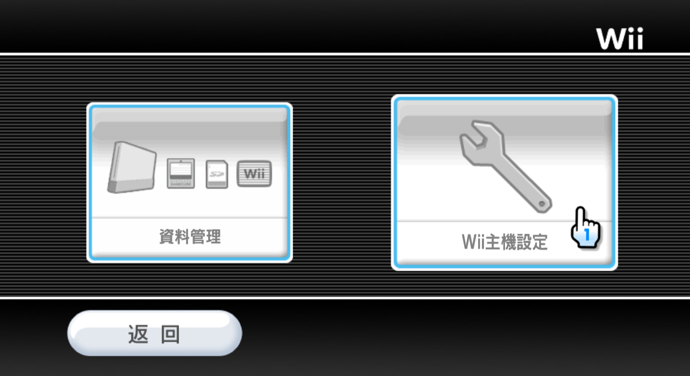

# Step 0: 有言在先

## 一、查看 Wii 的系统版本

1. 在系统主界面，点左下角的 Wii 按钮进入主机设定： 
  

2. 在主机设定界面，点右边的按钮进入 Wii 系统设定： 
  

3. 如下图所示，画面右上角会显示 Wii 的系统版本为 4.1J： 
  

## 二、版本号和地区码

以上图的 4.1J 为例：

- 前面的数字 4.1 是版本号，数字越大系统越新。目前最新的版本号是 4.3；

- 后面的英文字母 J 是地区码。Wii 的官方系统一共有四个地区，地区和地区码的对应关系如下表所示：

| 地区 | 地区码 | 系统版本示例 | 说明 |
| --- | --- | --- | --- |
| 欧版 | E | 4.1E | |
| 美版 | U 或 C | 4.1U、4.1C | 4.1C 是自制系统，基于官方 4.1U 系统制作 |
| 日版 | J | 4.1J | |
| 韩版 | K | 4.1K | |

## 三、本教程适用的系统版本

如果你的 Wii 系统版本号为 4.2 或者 4.3，请切换到匹配的教程再继续。

本教程只适用于系统版本号为 4.1 或者小于 4.1 的 Wii，即：

| 地区 | 适用的系统版本 |
| --- | --- |
| 欧版 | 4.1E、4.0E、3.4E、3.3E、3.2E、3.1E、3.0E |
| 美版 | 4.1U、4.1C、4.0U、3.4U、3.3U、3.2U、3.1U、3.0U |
| 日版 | 4.1J、4.0J、3.4J、3.3J、3.2J、3.1J、3.0J |
| 韩版 | 4.1K、3.5K |

本教程用古早的 3.0J 系统验证过是可行的：

