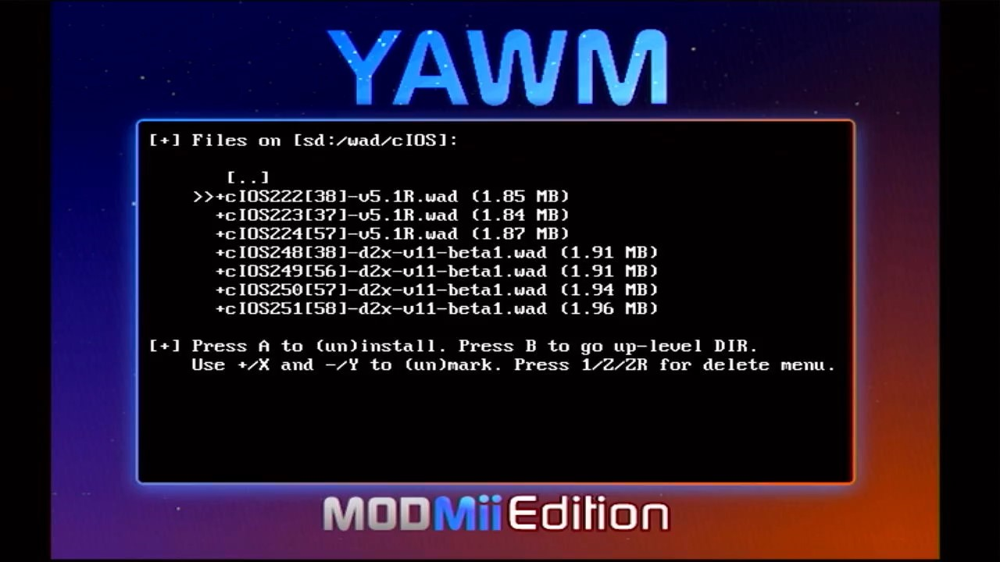
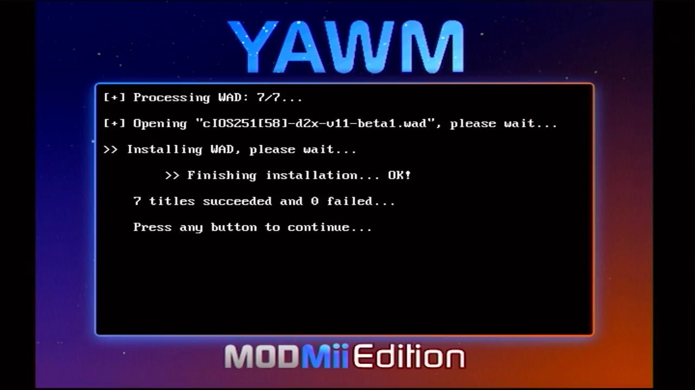

# Step 2: 安装 USB Loader 使用的 cIOS  {#step2}

## 一、相关文件

| 文件 | 出处 |
| --- | --- |
| YAWM ModMii Edition | <https://github.com/modmii/YAWM-ModMii-Edition> |
| 7 个 cIOS 安装文件（.wad 格式） | <https://modmii.github.io> |

## 二、注意事项

- 本文重在阐述安装步骤，相关知识点请参考[《USB Loader 使用的 cIOS》](../cios-for-usb-loader/README.md)；

- YAWM ModMii Edition 会进行严格的地区信息检查，在欧美日韩以外的非主流机型上运行可能会出现以下错误：

  

  这个问题换一个 APP 就能解决，详情请参考[《安装 USB Loader 使用的 cIOS（2022 版）》](@ref some-yawmm-mod)。

## 三、安装步骤

1. 在 HBC 运行 YAWM ModMii Edition： 
  

2. 一般情况下，APP 启动之后会进入 Select source device 界面：
  - .wad 文件在 SD 卡上的，请选择 Wii SD Slot： 
    
  - .wad 文件在 USB 设备上的，请选择 USB Mass Storage Device： 
    

3. 进入 `wad/cIOS` 文件夹，可以看到 7 个 cIOS 对应的 .wad 文件，如下图所示： 
  

4. 先按遥控器手柄的方向键，使 >> 指向第一个 .wad 文件，然后按住 [+] 号键不放，等所有 .wad 文件名前面都出现 + 号再松开，最后按 [A] 键启动安装；

5. 按 [A] 键继续： 
  

6. 耐心等待安装结束： 
  

7. 看到以下界面即表示安装成功： 
  

8. 按两下 [HOME] 键退出 APP。
